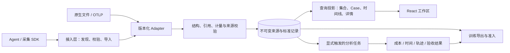

# Trace Hunter：可行、可扩展、对 agent 友好的接入设计

决策日期：2026-09-10。本文确定工程边界与接入方式；论文及固定版本源码依据见 [RFC 0002](../rfcs/0002-general-trajectory-contract.md)。**交付目标是可实施的设计及验证原型，不宣称 v2 已在生产上线。** 线上仍使用 1.1。

平台范围以[平台主设计](platform-contract-and-plugins.md)为准：完整轨迹标准、评测集环境规范、PostgreSQL、插件与查询边界。本文集中说明接入工程验证，既有来源的能力限制不限制平台标准。

## 1. 核心决定

**对外是轻量接入动作，对内是一份完整、不可变、可追溯的事实模型。** Agent 提交原文件和任务绑定，adapter / SDK 负责格式转换、身份生成、引用、校验和打包。Agent 不需要在对话中编写数千行 Schema 实例，也不需要计算哈希或凭日志猜齐缺失字段。

系统保持三条独立边界：

1. **采集事实：**模型请求、工具执行、用户消息、实际上下文、压缩/恢复事件、来源、环境。
2. **平台投影：**集合 / Case / 同 Case 多运行对比，工具方格与详情，按范围查询。
3. **后触发分析：**成本、轨迹、时间、业务验收、质量评分及训练导出。

导入成功只说明数据可接收。是否采集完整、任务是否完成、是否符合训练要求，分别判断。相同 `query_id` 仍允许跨 harness、模型和 `env_id` 比较；环境差异可见，不被悄悄当作模型差异。

## 2. Agent 使用方式

高层接入动作定义为 `import_trace(file, binding)`。绑定只包含调用者才能决定的任务身份；文件中已有合法身份时沿用，有冲突则报错。平台执行任务时提前分配 run ID，采集器持久化后随运行携带；手工导入由 SDK/服务创建一次 run 并保存 receipt，重试复用同一身份。

| 场景 | Agent 提供 | 系统负责 |
|---|---|---|
| 平台启动一次任务 | Case、环境配置 | 分配 run / capture / producer 身份，返回采集上下文 |
| 导入现有 Trace Hunter 1.1 | 原文件 | 沿用 query/env/run ID，归并明确的重复片段，记录能力缺口 |
| 导入 ATIF 等原生文件 | 原文件、query_id、env_id、run_id | 识别支持的格式版本，转换为标准记录，保留原字节 |
| 自定义 harness 实时采集 | SDK 生命周期调用与已观测值 | 生成稳定事件 ID/序号、关联请求、缓存上报、重试和封存 |

离线原型目前可直接运行：

```bash
.venv/bin/python scripts/trace_agent.py describe
.venv/bin/python scripts/trace_agent.py prepare examples/claude-orange.trace.json --output var/agent-import/claude
.venv/bin/python scripts/trace_agent.py check var/agent-import/claude --require browse
```

ATIF 输入需要显式绑定，原型不会把 session_id 猜成 query_id 或 run_id：

```bash
.venv/bin/python scripts/trace_agent.py prepare path/to/trajectory.json \
  --query-id supermarket-base --env-id vm-test-v1 --run-id trial-001 \
  --output var/agent-import/trial-001
```

结果只返回包位置、能力状态、问题数量和下一步动作；完整内容写入文件。`check` 默认最多返回 6 条问题及紧凑统计，`--full` 才返回完整映射报告。标准输出为 JSON，输入错误退出码 2；正文和工具返回不会混入错误消息。原型的 `live_import:false` 明确禁止误认为已经写入线上。

典型错误格式：

```json
{
  "ok": false,
  "retryable": false,
  "issues": [{
    "code": "REFERENCE_MISSING",
    "path": "/spans/0/model",
    "severity": "error",
    "message": "记录不符合跨字段或跨记录约束。",
    "fix": "修正该处引用，使其指向同包中存在的记录；未知关联可留空。"
  }]
}
```

错误同时提供稳定 code、JSON Pointer 和修复动作。缺少 token 的修复动作是补采或保持未知；不会建议填 0 来绕过验证。未知来源版本直接返回 `FORMAT_UNSUPPORTED`，不运行上传文件中的任何代码。

## 3. 系统结构



先在现有 FastAPI + PostgreSQL 中实现模块边界；前端保持独立。无需为每个来源部署独立微服务。分析任务和大内容存储在出现实际负载后再独立运行，领域模型与调用方式不随部署方式改变。

## 4. 核心模型与扩展点

| 对象 | 职责 | 扩展规则 |
|---|---|---|
| Catalog / Case | 任务集、query_id、固定单轮/多轮输入 | 目标或约束变化用新的任务版本；可加入验收器引用，不塞执行结果 |
| Run | 一次任务尝试，绑定 query/env | harness/version 与显示标签分开；实际模型身份在每个请求中记录 |
| Document / Capture | 不可变快照与持续采集生命周期 | 补采是新 revision，旧原文与旧分析保留；快照数量不是尝试数 |
| Segment / Clock | 进程执行段、恢复与时钟域 | 支持不同 session、不同环境观测与不同时间原点；无对齐证据不计算跨域墙钟 |
| Span | 一次模型、工具、等待、代理或不透明批次观察 | 公共字段 + 类型化细节；未知操作保留原名，归 other，不丢弃 |
| ToolCall | 模型提出的调用提案 | 与执行分开；可关联零次或多次有真实 attempt 身份的执行 |
| Message / Context | 消息记录与当次实际模型输入 | 大内容使用引用，复用历史不增加用户轮数；上下文变化不覆盖旧记录 |
| Event | 压缩、checkpoint、resume、采集缺口等 | 已知事件有类型；新事件先走 other + 来源，再通过小版本扩展 |
| Artifact / Source | 原始字节、业务产物与状态快照 | 通过哈希与引用定位；不自动读取用户上传的外部 URL 或本机路径 |
| AnalysisResult | 版本化分析、评分、修复建议 | 绑定输入 digest / scope / evaluator/rubric，不修改事实 |

固定核心字段用来保证可比较性；`extensions` 必须使用 `vendor.feature` 这样的命名空间，按原样保存。扩展数据不获得代码执行能力，也不自动进入 token 和耗时累计。

每个 adapter 实现同一函数：

```text
convert(raw_bytes, parsed_source, binding)
    → Conversion(document, issues, mapping)
```

主流水线统一处理结构校验、来源指针、包完整性和能力报告。新增来源只需增加可信 adapter、登记支持的版本、提交 fixture 与契约测试。原型的注册测试已用一个额外合成来源证明无需修改核心 Schema 即可保留新扩展。

兼容规则：输入记录无法识别的顶层字段报错；有命名空间的扩展保留。读取旧记录不得按新解释静默重算原始事实。新增字段升级小版本；身份、时间或消费语义变化升级大版本。adapter 版本、源版本与标准版本分别记录。当前草案尚未冻结，生产协议升级另行发布。

## 5. 数据真实性优先的规则

### 请求片段与计费

一次真实请求的多个观察片段可以共享 invocation / attempt。只有来源身份明确、usage 一致时才归并消费，所有原片段通过来源引用保留。用量冲突时排除不确定总量，并报告 `USAGE_CONFLICT`；不取最大值，也不相加。

当前 Claude 样本的 119 条模型记录按已记录身份归为 59 个请求，60 个重复片段不再累计用量。这是该来源记录的去重结论，不是对不可见模型调用数量的推断。和已有分析器按全阶段计算的 token 一致。[验证记录](../research/interop-validation-2026-09-10.json)

模型提出两个工具调用只产生一份模型消费。提案没有结果或执行开始证据时不创建执行 span；同一工具出现多个结果而没有 execution ID/attempt，无法区分分片与重试，flat ATIF adapter 明确拒绝这种歧义，等待原生适配规则。

### 时间精度与范围

`start_ms / end_ms` 是区间观测，`duration_ms` 可能是独立上报。默认派生时长必须与端点相容；独立上报须声明 `duration_basis=source_reported`，并注明 `duration_scope=elapsed / active / unknown`。差异可以保留，但不能混称同一个计量口径。

真实 Doubao 样本存在独立时长与端点差不一致。原型保留两套原值并报告 `TIMING_MEASUREMENTS_DIFFER`；没有凭差异反推精度或修改秒数。总体区间计算用端点，独立上报时长另列。用户等待、排队、限流用显式 wait.reason，不能把工具之间的空隙都当模型思考。

### 可用性与训练资格

能力按维度返回 available / partial / unavailable，并带已记录数、观测数和缺失原因：browse、tool_timing、token_totals、request_context。它依据采集声明与实际字段，不能证明采集器没有遗漏真实事件，也不证明来源诚实。

严格 SFT/RL 准入独立实现：SFT 至少检查真实请求上下文、工具定义、输出内容状态、任务验收及允许使用的范围；RL 另外检查原始 token IDs、tokenizer/template/model 版本、logprobs、loss mask 和奖励归因。当前原型始终将 sft / rl 返回 unavailable，不把完整聊天记录直接宣称为可训练数据。

## 6. API 设计与状态机

以下为 **v2 服务实现契约，尚未部署**。CLI 的现有动作是这些接口语义的离线参考。SDK 可把上传、校验、提交包装成一次调用，agent 不必手动执行所有内部步骤。

| 接口 | 关键语义 |
|---|---|
| GET /api/v2/capabilities | 返回协议版本、adapter 版本、能力 profiles、大小限制、错误字典和 Schema 地址 |
| POST /api/v2/sources | 接收原始字节，返回受当前项目约束的 source ID 与 SHA-256；来源正文不进 agent 工具输出 |
| POST /api/v2/validate | source ID + binding + adapter；只返回校验/能力/映射报告，不创建正式运行或触发分析 |
| POST /api/v2/imports | 同样输入加 Idempotency-Key、期望 base_document_id；事务中创建 run/document 与索引，返回 receipt |
| POST /api/v2/captures | 为 run 开启采集，返回 capture/producer 身份与初始 cursor |
| POST /api/v2/captures/{id}/batches | 追加 record ID、revision、producer sequence；同键同内容幂等，冲突返回 409 |
| POST /api/v2/captures/{id}/seal | 校验声明的末尾序号、缺口及引用，产生不可变 document；partial seal 明确保留缺口 |
| GET /api/v2/runs/{id}/timeline | cursor + limit + fields；方格只取轻量投影，详情按需读 |
| POST /api/v2/analyses | 显式选择 document、scope、分析器版本，异步返回 job ID；浏览和导入不触发 |

错误形状与原型一致。完整性错误 422，版本不支持 415，身份/修订冲突 409，超限 413。临时故障或限流才标 retryable=true，并返回 retry_after；结构和身份错误要求修正后再提交。错误结果有稳定定位，不用自然语言字符串判断分支。

状态分为两条轴：run.execution_status 记录运行是否结束；capture.state 记录数据是否封存。

```text
Capture: OPEN → SEALING → SEALED
                   ↘ OPEN（缺口未允许封存或可恢复错误）
Run:     RUNNING → COMPLETED / FAILED / CANCELLED / UNKNOWN
```

SEALING 在短事务中锁定截止序号，阻止新的批次越过边界。SEALED 后的新数据创建新 document revision，不覆盖原文；相同文档的网络重试返回同一个 receipt。相同记录 revision 但内容不同直接冲突。未知的关联在 OPEN 阶段可暂存，封存时必须明确 unresolved / partial，不补造目标记录。

至少一次传输 + 稳定 ID + 唯一约束 + 事务提供效果幂等，不宣称网络 exactly-once。写入与“稍后建立投影”的通知可用 PostgreSQL outbox 同事务提交，worker 重试按 document ID 幂等。长时分析不占据导入事务。

## 7. 存储、规模与运维边界

初始使用 PostgreSQL：

| 表/模块 | 关键键与索引 |
|---|---|
| runs | `(project_id, run_id)`；query_id / env_id / created_at 索引 |
| documents | `(project_id, run_id, revision)`；唯一 document ID，前驱引用、原始/规范化摘要 |
| sources | 项目范围内 source ID、字节摘要、大小、内容存储引用 |
| records | `(capture_id, producer_id, record_id, revision)`；kind / timestamp / sequence 索引 |
| ingestion_batches | `(capture_id, producer_id, batch_id)`，内容摘要、receipt、序号区间 |
| projections | 可重建的轻量查询索引；绑定输入 document 与 projector 版本 |
| analysis_jobs/results | document + scope + analyzer/rubric/pricing version；独立任务状态 |

project_id 来自认证上下文，不接受上传正文代替访问权限。当前线上是内网单用户实例；这只是 v2 多用户落地时的隔离设计，不宣称当前已有账户系统。

中小正文先随不可变 JSON 保存，大响应、图片和 token 数组通过附件引用保存。数据库 JSONB 可作可重建索引，原始字节与规范化哈希规则各自明确。上传限制按解压后大小、单记录、单包和内容深度分别检查；多文件 JSON 不是让 LLM 回显整个包。

先做好分页、稀疏字段、按需详情、请求上下文内容去重，再根据实际指标拆 worker 或对象存储。缓存和去重减少存储及读取成本，不能减少真实 input token 的账目。

升级使用旁路 adapter → 新旧投影对照 → 明确的新版本导入入口。线上旧 digest 与分析结果继续可读；不得把 schema 升级与历史数据重写捆绑。新增依赖继续执行至少 7 天发布冷却期和锁文件校验；本轮原型没有新增依赖。

## 8. 已验证的可行性与下一步边界

本轮实现并验证了：

- 两种入口 adapter（现有 1.1、ATIF-v1.7 flat），通用注册函数、机器化发现与检查入口。
- 原始字节不变、逐指针可解析；包内 manifest 校验、重复生成幂等、冲突不覆盖、拒绝符号链接文件。
- 工具提案和执行分离；未知工具名保留；copied context 不重复计消费；缺失调用数不补成 1。
- 六份现有输入的工具 ID、所有原始计时字段和 token 汇总一致；两份上游 ATIF 样例的 token 与来源 totals 一致，工具时间仍未知。
- 独立契约测试与接入测试，包括错误定位、原文不回显、用途不足返回明确错误。

验证证据见 [source-by-source 报告](../research/interop-validation-2026-09-10.json) 和 `tests/test_interop.py`。新增 adapter 注册测试、上游数据对照、原始时间差异样本属于独立证据；不是仅用生成的合成数据证明设计可行。

下一阶段是按本设计实现 v2 服务：数据库修订/批次/seal/权限/分页、OTel/OpenInference adapter、嵌套 ATIF 和真实训练 profiles。这些是实现路线，不是当前已经开放的服务。当前设计原型不改变线上 API、数据库、轨迹或分析缓存。

## 9. 设计目标验收

| 目标 | 验收依据 | 当前结论 |
|---|---|---|
| 可行 | 两个不同数据体系接入；既有数据与上游样例对照；部署和迁移边界有定义 | 已验证离线数据链路；服务实现范围明确 |
| 高扩展度 | 核心对象、扩展命名空间、版本/adapter注册、内容引用、异步分析和存储分层 | 模型和接口已定义；额外 adapter 注册测试通过 |
| Agent 友好 | 轻量入口、自动身份/引用生成、discover、紧凑 JSON、定位+fix、幂等与能力缺口 | CLI 与对应测试可运行；HTTP/SDK 采用同样语义设计 |
| 事实保真 | 原始字节和引用验证，未知不造值，去重与独立计时口径，训练资格分离 | 8 份来源验证记录及反例测试 |
| 与现有产品一致 | 集合→Case→对比；query/env规则；后触发三类分析；兼容旧输入 | 本轮没有改动线上路径，v2 升级单独实施 |

设计交付已覆盖上述目标。生产 v2 实现完成与否须按独立实施任务验收，不能把这份设计的完成等同于生产上线。
