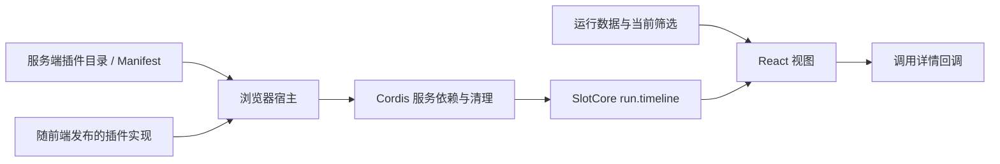

# 浏览器插件宿主 1.0

状态：已实现。调用方格和调用列表通过此宿主加载，公共 Manifest 仍为 `trace-hunter/plugin/2.0`。后端继续使用 FastAPI、PostgreSQL 与已有任务执行器。

采用 DeepSeek 发布的 `@deepseek-ai/cordis@4.0.2` 管理服务依赖与生命周期，`@deepseek-ai/dsh-client-ui-slots@0.1.2-alpha.5` 的 SlotCore 管理有类型的贡献点。Trace Hunter 自己提供 React 适配层和运行数据上下文。源码与实际运行依据见 [Harness 研究](../research/plugin-composition-from-dsh.md)。

## 连接方式



服务端目录声明插件版本及可用执行位置，浏览器还必须包含完全匹配的本地实现。宿主比较完整 Manifest（含包摘要）、原生来源和各贡献点的 runtime；只登记 Manifest 不会下载或执行 JavaScript。

服务依赖用于决定什么时候激活、撤下组件。它没有取代后端任务编排，也不意味着派生产物之间已经有持久化依赖图。分类、评分与远程 Agent 继续通过[通用计算合同](../guides/general-plugins.md)运行。

## 开发接口

实际定义见 [contracts.ts](../../apps/web/src/plugins/host/contracts.ts)，实现见 [runtime.ts](../../apps/web/src/plugins/host/runtime.ts)。

```ts
interface BrowserPlugin {
  manifest: PluginManifest;
  requires?: (keyof BrowserServices)[];
  activate(context: BrowserPluginContext): void;
}

interface BrowserPluginContext {
  get<K extends keyof BrowserServices>(name: K): BrowserServices[K];
  provide<K extends keyof BrowserServices>(name: K, service: BrowserServices[K]): void;
  effect(setup: () => (() => void)): void;
  registerView(contributionId: string, component: RunView): void;
}
```

这是内部 TypeScript SDK；它不向公共 JSON Schema 塞入函数。当前激活回调为同步函数。外部数据加载放在 React 的 effect 或宿主管理的资源中，必须提供取消和清理，不把未等待的异步激活当作加载成功。

官方适配器 [call-activity.ts](../../apps/web/src/plugins/call-activity.ts) 展示了最小实现：

```ts
export const callActivity: BrowserPlugin = {
  manifest: validatedManifest,
  requires: ['hostVersion'],
  activate(ctx) {
    ctx.registerView('grid', GridView);
    ctx.registerView('list', ListView);
  },
};
```

`grid`、`list` 是 Manifest 中的贡献点 ID。宿主要求 renderer、browser、run scope、view trigger 与 `run.timeline` 挂载点全部一致。内部 slot key 使用 `implementation.ref`；重复注册不能覆盖别的插件。

`RunViewProps` 由平台提供：

| 字段 | 含义 |
|---|---|
| bundle | 当前运行的标准轨迹、来源与展示数据 |
| rows | 已筛选的 `{row, index}`，index 保留原调用序号 |
| metric / colors / showLetters | 用户选择的时间口径与显示配置 |
| inspect(row, index) | 打开平台已有调用详情 |

插件按只读约定消费这些数据；同一页面多个 Run 分别获得自己的 props。注册表在应用范围存在，不把某一 Run 的数据放入共享单例。切换方格/列表保留平台维护的筛选条件和原总量。

需要共享服务时，作者通过 TypeScript module augmentation 扩展 `BrowserServices`，提供者调用 `ctx.provide`，消费者在 `requires` 声明并通过 `ctx.get` 读取。缺少提供者时消费者等待；提供者退出时 Cordis 清理消费者的 effect，恢复时再激活。

事件订阅、定时器等通过 `ctx.effect(() => dispose)` 归属当前激活实例。组件内部资源使用 React effect 清理。禁止自行留下无归属的全局监听器。

## 生命周期与页面状态

| 状态 | 行为 |
|---|---|
| active | 服务满足、激活完成，展示已注册视图 |
| waiting | 缺少服务，不渲染半完成的视图 |
| failed | 激活失败，清理部分注册；支持重新启用重试 |
| disabled | 当前浏览器页面主动停用，撤下视图和资源 |
| standby | 可用但未选中的 UI 插件，不激活其界面或效果 |
| unavailable | 实现、版本或执行位置不匹配，不使用硬编码旧组件兜底 |

目录更新串行处理并合并到最新快照；旧请求与卸载中的实例不能重新挂回视图。组件渲染错误由独立边界呈现，不让一次 renderer 报错导致整页消失。

「插件」目录按插件 ID 聚合为卡片，默认最新版本，旧版在详情中选择。卡片与详情可以停用、加载界面视图；宿主只激活一个 renderer owner，切换时等待旧实例 effect 清理完成，纯服务依赖继续并行。选择保存在当前浏览器，跨站内导航和整页刷新保留。目录在首次打开、窗口重新获得焦点或点击刷新插件时读取；失败会展示错误并保留上次成功目录，暂不轮询。它不是服务器安装/卸载状态，也不停止后台分类任务。

## 接入和发布

1. 声明稳定 Manifest 和不可变包摘要，在对应宿主提供实现。
2. 将可信前端实现包装成 BrowserPlugin，加入 [Provider](../../apps/web/src/plugins/host/react.tsx) 的本地定义列表；补充服务端可用实现映射与包校验。
3. 验证服务缺失/恢复、启停清理、异常回收及数据选择不串 Run，再按锁定依赖构建发布。
4. 登记匹配的版本后，目录与已发布代码共同决定可用状态。修改插件包内容必须发布新版本。

本次只增加平台适配层，官方 1.0.0 包里的原 renderer、slicer、classify 文件未改动，原包摘要保留。

## 当前边界与验证

- 已迁移方格与列表。即时切片控件目前仍由页面组装；分类与评分走原后端任务系统。
- 首个插槽为 `run.timeline`。其他页面插槽、第三方前端包分发、全工作空间启停持久化，尚未提供。
- 浏览器插件是随代码发布的可信模块；生命周期管理不提供不可信 JavaScript 的隔离沙箱。
- 远程 Agent 自动调度、派生结果作为后续计算的固定输入，以及跨插件执行图，是后续独立工作。

[宿主测试](../../tests/test_browser_plugin_host.mjs)覆盖目录/包匹配、runtime 门禁、启停、错误回收、重复贡献点、依赖撤销恢复、逆序激活、排队更新与销毁。与现有切片测试共 10 项；另有 19 项后端插件回归通过。真实 API 页面验收了 288 个调用方格、Read 筛选后在列表/方格间保留 39 条调用、原序号详情，以及停用后跨导航撤下视图、重新启用恢复；浏览器未报告控制台错误。

两项直接依赖及两项传递依赖均满足固定的 2026-09-03 冷却期，并核对官方日期、源地址与 SHA-512。四个包的 MIT 声明保存在 [browser-plugin-notices.txt](../../apps/web/public/browser-plugin-notices.txt)，随静态发布提供。依赖记录见[安全规则](../security/dependencies.md)。
