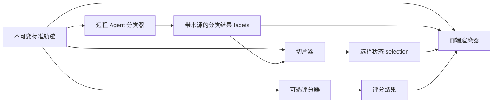

# 通用插件：渲染、评测与分类切片

状态：通用架构设计；renderer、filter、classify、evaluator 的首版运行时已实现，稳定合同与实际边界见[通用插件接入 2.0](../guides/general-plugins.md)。后文保留目标设计；完整 scopes、远程 Agent 自动调度与派生依赖解析仍属后续工作。

**插件是版本化的能力集合。评分器是其中一种贡献点，渲染器和分类切片器同样是插件。** 一个插件可以只提供一种能力，也可以包含多个贡献点，分别在合适的执行环境中运行。

跨插件服务装配、前后端入口及派生产物组合的后续设计，见[DeepSeek Harness 源码与运行研究](../research/plugin-composition-from-dsh.md)和[真实 Harness 插件实验](../../labs/dsh-plugin-lab/README.md)。实验不改变当前稳定 2.0 合同；尤其区分服务依赖、调用编排和数据来源三种连接。

浏览器侧已采用 Cordis 服务依赖和 SlotCore，实现方格/列表的激活、撤下与有类型的 `run.timeline` 插槽，详见[浏览器插件宿主 1.0](browser-plugin-host.md)。这是本页目标设计的第一步，其他插槽和派生产物串联仍未实现。

## 两个独立维度

| 维度 | 回答什么 | 值 |
|---|---|---|
| 能力 kind | 给平台增加什么 | renderer、evaluator、slicer |
| 执行宿主 host | 实现在哪里运行 | browser、server、remote_agent |

remote_agent 表示由 Agent 服务执行，不代表一定评分；server 可为平台托管或外部程序服务。HTTP、MCP 是接入方式，Skill 是实现载体，这些都不能代替能力分类。各能力仍有约束：实际挂载前端 UI 的 renderer 在 browser，远端生成展示数据的部分单独声明为计算能力。

## 三类贡献点的输入输出与触发

| 能力 | 输入 | 输出 | 触发 |
|---|---|---|---|
| renderer | 标准轨迹、已存在的派生数据、选择状态 | 挂载到指定位置的视图，例如方格、时序图、业务产物预览 | 用户打开视图；允许读取，不创建计算任务 |
| evaluator | 固定轨迹范围、验收条件、配置 | metrics、findings、evidence，以及本次评测用量 | 用户或授权工作流显式发起 |
| slicer / filter | 原始字段或已有分类维度、筛选条件 | selection，即当前输入范围内的记录集合 | 用户筛选；不生成新分类或评分 |
| slicer / classify | 固定轨迹范围、分类规则或 Skill | facets 与实体分类，可多标签，保留未知状态和证据 | 显式发起；规则程序或远程 Agent 均可执行 |

把“生成分类”和“按分类筛选”分开声明，是为了让筛选保持快速、可预期。打开切片菜单不会悄悄调用大模型。普通渲染与筛选不需要 queued/running 的任务状态，也不必提交分数、token 或费用。

例如一个“任务执行阶段”插件可以包含三个贡献点：Agent 把调用标成探索/实现/验证；切片器让用户选择阶段；渲染器按这些标签展示时间线。该插件可以完全没有评分能力。也可以再提供一个 evaluator，利用相同分类评价执行效率。

## 通用 Manifest

公共字段只保存身份、版本、包摘要和贡献点列表：`plugin_id / version / title / description / package_digest / contributes[] / extensions`。

每个贡献点有独立 id、kind、implementation、scopes、consumes、config_schema/default_config、trigger、output_kind 和 permissions。renderer 才有 mounts，evaluator 才有 metrics/requirements，slicer 才有 mode。不要求所有插件声明 metrics 或走 evaluation_submit。

`implementation.ref` 是受控解析的实现标识；远程服务地址、鉴权方式、并发限额和部署凭据放在独立执行绑定中。注册声明不会自动下载、启动或信任实现。一个包中的不同贡献点可绑定不同宿主，同一包摘要覆盖这些实现的发布版本。

贡献点依赖通过有版本的输入合同连接。分类输出遵守 facets 合同，任意兼容的切片器或渲染器都可消费，不强制只能在原插件内部使用。执行时锁定实际输入与派生产物的摘要，不能把“最新分类”混入已经完成的分析。缺少依赖时展示待生成/未分类，由用户显式运行生产者。

机器定义：[plugin-v2 草案](../../contracts/drafts/plugin-v2/README.md)。纯渲染插件、远程分类与前端组合插件、旧评分插件兼容映射都有合成样例。

## 数据与交互边界

- 原始标签、评测集/环境标签、插件派生标签分层保存。分类器不能覆盖原始工具类型，UI 可展示派生分类的来源与插件版本。
- facets 只表示分类，不自带好坏。明确的规则或评分器才能把某个分类解释为通过/失败。缺少分类时保留 unknown，不能变成 false、0 或一个虚构类别。
- 分类可声明单选或多选；计数按唯一实体计算，多标签总数不冒充调用总数。输出中的实体引用必须包含文档摘要，防止不同 Run 的 span ID 重名。
- 分类与选择的目标可为 collection、case、run、turn、span 或 artifact，引用其所属的目录、轨迹或产物文档版本。集合内的 Case 分类和单条轨迹内的工具分类使用同一引用规则。
- facets 的 coverage 表示输入范围是否都已处理；完整处理仍可包含无法分类的 unknown。类别分布分别显示 assigned、unknown 和 not_applicable，不能把处理覆盖率当作分类准确率。
- filter 输出引用当前输入集合中的实体，不输出可执行 SQL。零条匹配是合法空集，不是插件失败。筛选保留调用的原始顺序；原运行总时长/轮数不因隐藏方格而改变。对筛选部分计算统计时，显式标出范围。
- renderer 通过前端 Host API 读取标准数据、订阅 selection、发出选择事件并卸载资源。`mount(context) → dispose()` 是拟议的组件契约，不能通过登记任意脚本 URL 就获得平台会话权限。声明式视图或经过接入校验的组件可以使用同一挂载点。
- 计算结果存为独立派生产物，统一保存插件版本、contribution_id、固定输入与选择摘要、配置摘要及执行记录。payload 按 evaluation 或 facets 等合同校验；纯视图与临时筛选状态不伪装为计算结果。

## 对平台结构的影响

这部分是目标设计，尚未执行数据库迁移：

| 平台部件 | 职责 |
|---|---|
| Plugin Registry | 通用版本、贡献点、输入输出合同和声明权限；登记不等于已安装或已授权 |
| Frontend Host | 挂载 renderer，管理贡献点生命周期、切片控件和共享 selection |
| Execution Service | 为 evaluator 和 classify 等计算能力创建任务，处理不同本地/远端执行器 |
| Derived Artifacts | 保存评分、分类及其来源；以类型化 payload 扩展，不要求每个插件新建业务表 |
| Query Service | 统一查询原始事实、可见的派生产物、筛选成员；插件不直接连接数据库 |

当前五张评测相关表仍服务 evaluator。后续保留评分特有的指标查询，把通用执行信息抽到 plugin_invocations / attempts，派生输出抽到 plugin_artifacts，注册表增加贡献点。无需给 renderer 新建“评分任务”，也不把页面选择状态写进评分结果表。

页面入口应从“评测插件”演进为“插件”，按能力筛选；同一插件可显示多个能力标签。renderer 出现在视图选择器，slicer 出现在轨迹/列表的切片区域，evaluator 出现在运行分析入口。计算型分类器在切片区提供“生成分类”动作与结果版本选择，已有分类的筛选保持即时。

## 兼容与实施顺序

1. 保留稳定 `trace-hunter/plugin/1.0`；以只读映射把旧插件视为含单个 evaluator 的能力集合。旧 Manifest、输入摘要、评分结果不重写。现有 HTTP/MCP 仍只支持已发布的评测合同。
2. 实现通用注册和前端 Host，把已有方格作为官方 renderer，Read/Bash/Write 过滤作为官方 filter，验证没有评分器也能完成渲染与筛选。
3. 增加 facets 产物、分类状态与来源展示；先用确定性分类器打通，再接远程 Agent 的 classify。
4. 把已实现的 evaluator 接到同一贡献点目录，复用任务租约和结果证据能力，保持评分与分类各自的输出语义。

远程 Agent 因此既可以做评分插件，也可以做分类插件。其启动、任务映射、取消与鉴权适配仍需对接实际远程服务；MCP 本身不负责启动 Agent。浏览器只消费服务返回的已授权数据，不携带远程服务管理凭据。

### Roadmap：分析上下文中的插件管理

- [ ] 在“轨迹分析”内选择当前分析上下文要开启或关闭的插件。计算能力仍需显式触发；UI 插件保持单选互斥，切换时卸载前一插件。此项为后续计划，本轮不新增页面开关。
