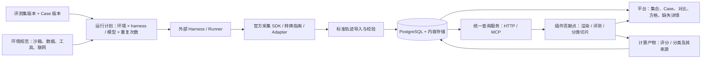

# Trace Hunter 平台设计：标准数据、环境与通用插件

状态：**目标设计与离线契约原型，尚未作为线上 v2 发布**。2026-09-10。

训练模型级基础设施的新增总体设计见[训练数据生命周期](training-data-platform.md)：查询、读取分析结果、回放验收、训练发布、消费账本和模型反馈。本页继续定义基础任务、环境、轨迹与插件对象。

产品总体定位是面向人和 Agent 的统一协议中枢。本文描述任务、环境、轨迹与插件的数据领域；跨领域的资源、能力、执行和产物协议，以及 Agent 的发现、组合与恢复体验，见[协议中枢研究](../research/agent-hub-architecture.md)。该研究包含候选接口样例和端到端验收任务，尚未改变线上协议。

本文是平台后续建设的主设计，按完整轨迹定义标准，不以某个客户端的采集限制为上限。[RFC 0002](../rfcs/0002-general-trajectory-contract.md) 保留论文、源码和底层轨迹语义；[接入原型](agent-friendly-ingestion.md) 仅作为 adapter 的工程验证。插件范围以更新的[通用插件架构](general-plugin-model.md)为准：渲染器、评测器、分类切片器均为贡献点，评分只是其中一种能力。

导入边界以[中性轨迹导入](neutral-trace-import.md)为准：单条轨迹内 turns[] 表示单轮/多轮，批量信封 items[] 容纳独立轨迹；query/env 可后绑定，不要求先注册评测集。

## 1. 平台对象与能力扩展

**平台管理任务、环境、事实、查询、视图宿主及计算生命周期；插件扩展渲染、评测和分类切片。** 平台提供统一贡献点和类型化输入输出，同一插件可组合多种能力，不要求所有插件都输出分数。

| 契约 | 回答的问题 | 独立版本 |
|---|---|---|
| Benchmark / Case | 做哪些题，以什么输入和条件算一次尝试 | 评测集发布版、Case revision |
| Environment | 在什么环境、初态、权限与联网条件下做 | env_id + revision + 资源摘要 |
| Trace | 一次执行实际发生了什么，记录是否完整 | schema_version、document revision、采集器版本 |
| Plugin | 提供哪些能力、需要什么数据、在哪里运行、输出什么 | plugin_id + version + package digest + contribution_id |
| PluginArtifact | 对哪份输入用哪种方法生成评分或分类等派生数据 | input/selection digest + plugin/contribution/config 版本 |

这是一个逻辑协议，由可组合的 Schema 组成。导出时可以打包；数据库和查询接口不必每次传输一个巨大 JSON。

## 2. 评测集必须规定运行条件

导航层次保持 **评测集 / 任务集 → Case（query_id）→ 多次 Run 对比**。Experiment 是一次批量执行计划，属于评测集内部，不增加日常导航层级。

| 对象 | 必须明确的内容 |
|---|---|
| BenchmarkRelease | id/revision；有序 Case 版本引用；每题允许的 Environment 版本；重复次数、seed 策略、超时/token/工具上限；多轮交互策略；默认评测插件版本 |
| CaseRevision | query_id/revision；标题和原始输入；目标与约束；单轮、脚本多轮或交互多轮；初始附件；验收规范引用 |
| EnvironmentSpec | env_id/revision；sandbox/non_sandbox；VM/container/host 类型；镜像或机器配置摘要；初始数据/依赖/工具及技能版本；reset 方式；网络、权限、资源、时间与外部服务策略 |
| RunPlan | 锁定上述版本；harness/config 与模型候选；attempt index；seed；每次独立初态；budget；执行器接收后返回 run_id |
| EnvironmentObservation | 实际环境指纹、初始化结果、观测时间、隔离及联网状态、运行中变化；与要求逐项对照 |

允许非沙箱评测，但必须显式声明外部服务、数据时间窗口及 reset 约束。沙箱与联网是两条轴：沙箱仍可以访问实时服务；容器镜像固定也不意味着远端数据库固定。模型网关允许联网，可与业务工具断网分开配置。

标准发布不能用 `unknown` 代替环境要求。历史或外部导入允许环境未知，标为 `unverified`。符合要求是 `matched`，明确偏离是 `mismatched`；这是运行条件符合性，不是任务得分。

相同 query_id 仍可查看对比；默认统计分组再锁定 Case revision、环境要求及执行策略。跨版本或条件不符的 Run 保留可见，默认不混入标准排名。条件差异是实验变量时，在计划中显式声明。结果必须显示完成/失败/缺数据/未评测数量，不能只展示成功样本。

多轮 Case 固定的是交互政策，不强求固定全部后续文字。脚本轮次固定输入顺序；交互轮次记录用户模拟器及其模型、提示词版本、seed、终止规则；真人参与则记录参与方式与等待区间。实际 turns 存在 Trace 中。私有验收答案只向评分插件开放，不进入被测 agent 上下文。

## 3. 完整轨迹应该有什么

下面定义完整采集目标。**必须提供结构与缺失声明，不要求用假值凑齐内容。** 若某类事件确实没发生，显式声明完整且数量 0；若没有采集，标 missing 或 unknown，二者不能混用。

| 数据域 | 完整记录 | 采集要求与缺失影响 |
|---|---|---|
| 身份与版本 | run/document 身份；可选 query/env 关联；Case/环境版本；harness、collector、adapter、代码/config/prompt 版本；父运行/尝试 | run/document 为硬必填；任务关联可后补；未记录版本须声明缺口，无法确认可复现条件 |
| 执行环境 | 要求引用、实际配置、初态、工具清单、权限、网络、资源限制、变化事件、结束状态 | 标准评测必须有要求与符合性证据；环境验收插件需要相应初态/终态 |
| 会话与轮次 | 原始用户消息、system/developer 指令、实际用户轮次、agent/子 agent、执行段、终止原因 | 是多轮展示和归因的基础；上下文重复不增加轮数 |
| 模型请求 | 每次 request/attempt；真实 provider/model/version；完整 request（有序消息、工具定义、采样/预算参数）；响应内容/finish reason/error | 每次真正发出的请求均记录；重试和压缩请求也记录；不以最终聊天重建请求 |
| 工具与技能 | 调用提案、实际 execution/attempt、原名与版本、参数、返回/错误、依赖；skill 名称/版本/内容摘要与 load/invoke | 一个提案可无执行或有多个重试；Read + skill 标记是 Read，后续 Bash/Write 独立记录 |
| 时间 | 时钟域、开始/结束、首响应边界、工作时长、排队/用户等待；执行段时钟对齐证据 | 不能用前后工具间隔充当模型耗时；缺失不参与精确耗时总计 |
| 用量 | 逐请求输入/输出、缓存读写、reasoning 子项、原始 provider usage、消费归属 | input 包含缓存，output 包含 reasoning；收费分析另需版本化价格表 |
| 控制事件 | compaction、checkpoint、resume、fork、interrupt、retry、工具集变化、采集缺口；前后上下文/检查点引用 | 未发生可为完整空集；发生但未记录会影响轨迹分析/恢复能力 |
| 业务产物 | 文件、网页、表格/数据库快照、diff、最终回答、验收所需状态；内容摘要与关联步骤 | 任务质量以目标和产物为证据，工具 status=ok 不能代替业务验收 |
| 来源与内容 | 原始日志/请求响应引用、内容哈希、MIME、大小、采集时间、截断/脱敏状态；附件可解析性 | 浏览摘要与原文分开；只保存 URL 而内容已变不能视为固定证据 |
| 可扩展元数据 | tags、labels、外部 IDs、实验变量、命名空间 extensions | 可扩展且可筛选，不自动变成可求和指标 |
| 可选训练信息 | 实际 token IDs、tokenizer/template 版本、logprobs、loss mask、奖励归因 | 属于训练 profile；缺少这些不阻止常规评测，也不称为“轨迹不完整” |

“完整”必须相对于 profile 和范围：`execution/1` 面向执行评测，`training-rl/1` 是额外要求；不是所有插件都需要所有字段。API 使用同一 data requirement 描述 profile 与插件要求，避免两套完备性标准。

### 最低导入要求与完整目标的区别

- **硬必填：**支持的 schema_version、run_id、不可变 document 身份、采集器身份、数据域覆盖声明、来源声明，以及每条记录的唯一 ID/kind/所属运行或执行段。query_id/env_id 可省略或 null，后续独立绑定；不要求先创建评测集或标准环境。被引用的定义必须随包提供或已存在平台；内容缺失可留显式状态，但非法 ID、重复冲突或伪造已存在引用拒收。
- **条件必填：**model 记录具有 request/attempt 和模型字段；tool 记录具有操作、参数与结果状态；有时间即有时钟与边界；有 usage 即有计量口径；有评分即绑定精确输入及插件版本。未知值配缺口，不改成 0。
- **完整目标：**上表适用域都完整；每条实际记录的所需字段可读、有来源。采集器声明 complete 后，校验器发现矛盾仍降级并给出路径。采集声明不能证明未被记录的现实事件不存在。
- **可选扩展：**用户标签、厂商私有字段、硬件补充信息、训练专用信息。只有对应 profile/插件要求时才成为准入条件。

`schema_version` 是格式版本；document revision 是同一次 Run 的新采集快照；Case/environment/plugin 版本是各自不可变定义。不要用一个 `version` 混指所有对象。查询可有 latest，执行和评测必须解析并锁定具体版本及摘要。

## 4. 缺失如何表达与呈现

保留领域字段原生类型，不给每个数字套一层大对象。必需但无值的字段填 null / 内容 state，伴随统一 `coverage` 和 `gaps[]`。未知不伪装为 not_applicable。

| 数据状态 | 语义 | 页面与评测行为 |
|---|---|---|
| complete | 当前 scope 内所需数据完整，含确知的空集 | 正常展示；仍需内容/引用校验 |
| partial | 一部分存在，一部分缺失或截断 | 展示已记录值和覆盖数；按插件策略继续或跳过 |
| missing | 已知所需数据不存在或未采到 | “未采集/来源丢失”；不填 0 |
| unknown | 无法确认是否记录完整或事件是否发生 | “未知”；不把观察数量当总体数量 |
| redacted | 原本有数据，导出时被脱敏/隐藏 | “已脱敏”；内容不可访问不算模型失败 |
| not_applicable | 这个范围确实不适用，附原因 | “不适用”；不进入对应缺失分母 |

每个 gap 包含 `domain + record_id + path + state + reason + detail`；可定位 `/spans/3/model/usage` 或整个域。域 coverage 包含状态、recorded_count、expected_count（未知为 null）。不计算一个混淆所有维度的“完整度总分”。

例如 10 次已确认请求，仅 8 次有 usage：显示“已记录 token 12,300；8/10 次有用量”，不称“总 token 12,300”。预期请求数未知则显示“8 次有用量，总次数未知”。可确认没有工具调用时 complete + 0/0 是完整空集，不是缺失。

方格始终保留可辨认调用及原顺序。无耗时标“耗时未知”，原始工具类型颜色保持；skill 常驻 S。模型时间与工具执行时间分行；共享一个模型请求的多个工具可以重复展示前置响应，但汇总只计一次。数据缺失、工具失败、环境偏差和评测未通过使用独立状态。

内容层现有 complete/partial/missing/redacted 与此兼容；unknown/not_applicable 在 coverage 中表达。`gap.reason` 描述未采集、截断、权限、来源丢失、格式不支持等原因；访问 API 的 permission_denied 另属授权结果，不把原始数据改写为 missing。

## 5. 数据库与基本功能

采用 **PostgreSQL 的结构化主表 + JSONB 扩展/可重建投影 + 独立内容存储**。先用本地内容目录实现 BlobStore 接口，规模增长换 S3 兼容存储；前端和插件不感知存储位置。

| 数据组 | 表与主要约束 |
|---|---|
| 任务目录 | collections/releases、cases/revisions、collection_case_members；发布版固定有序成员及 Case revision |
| 环境与执行 | environments/revisions、experiments/variants、runs；run 关联 Case、环境、计划及 attempt；要求与观测分开 |
| 事实 | trace_documents、capture_records、spans、turns、messages、contexts、events、links、artifacts；document 原文不可变，记录表是可重建索引 |
| 内容与来源 | blobs（digest/bytes/MIME/storage key）、sources（来源身份和授权范围）；大文本/图片/附件不重复塞进每个 span |
| 完整性与标签 | data_gaps、coverage_reports；entity_labels/tag_assignments（独立修订和审计）；修改标签不改变事实 digest |
| 插件与派生数据 | plugin_versions/contributions、plugin_invocations/attempts、plugin_artifacts；评分另有 metric_values/findings，分类有 facets；计算结果绑定输入快照，纯渲染与筛选不创建评测任务 |

所有外键和唯一约束包含 project_id，project_id 来自认证上下文。常用索引为 `(project_id, query_id, case_revision, created_at)`、`(document_id, kind, sequence, id)`、`(plugin_id, version, metric_key)`；标签使用受限 JSONB/关联表索引。父子关系和关联边使用关系表即可，初期不引入图数据库。

原始文件按字节摘要存储；规范化文档另外固定序列化规则/摘要算法，不能通过 JSONB 重序列化冒充原件。事实表与插件结果分离；插件只访问服务 API，不获得数据库账号。内容访问经过权限检查；私有 oracle 与普通任务输入分别授权。

批次导入使用幂等键、唯一约束、事务、采集序号和封存操作。新快照不会覆盖旧结果；所有分析都锁定 document digest。对象上传先暂存，再事务关联；孤儿对象延时回收。备份需要同时涵盖数据库与被引用内容，定期校验可恢复性。部署继续沿用独立前端/API/PostgreSQL，不要求先拆微服务。

平台最小功能按此顺序实现：

1. 评测集/Case/环境版本管理，发布运行规范；支持导入外部 runner 的执行结果。
2. 轨迹导入、结构和语义校验、内容存储、来源定位、覆盖度与缺口报告。
3. 集合→Case→对比，模型/harness/env/版本/标签筛选；方格、轮次、详情、下载。
4. 统一查询 API 与 MCP；插件注册、需求预检、用户触发评测、任务进度、结构化结果展示。
5. 官方成本/时间/轨迹插件逐步补齐，允许第三方插件；跨 Run 汇总、问题定位与人工标注。

平台本身提供分页、筛选、事实计数、计时区间等确定性查询原语。价格换算、效率判断、技能质量、业务验收、训练价值及综合分是插件计算。导入/浏览不触发收费模型或评分任务。批量 runner 调度是后续模块，可先通过外部 harness 按 RunPlan 执行再导入。

## 6. 评测贡献点：通用插件体系的一部分

以下仅讨论 evaluator。renderer 与 slicer 的合同、触发和组合方式见[通用插件架构](general-plugin-model.md)。评测首版已上线，实际接口与边界见[接入指南](../guides/evaluation-plugins.md)；[评测实现方案](evaluation-plugin-mvp.md)仍保留部分后续设计。

### 插件描述

一个发布包包含 manifest、实现（程序或 Skill/agent 指南）、输出 Schema、示例及测试。平台 registry 固定 package digest，安装与执行分别发生。Skill 描述方法和查询步骤；真正的身份、权限、数据准入和结果校验由平台实现。

manifest 至少包含：`plugin_id/version/digest`、支持的协议版本、入口类型、评测 scope（run/turn/span/comparison）、数据 requirements、缺失策略、permissions、配置 Schema、指标定义及输出版本。每个指标规定类型、单位、范围、方向和聚合方式；不存在默认“所有数值求平均”。

requirements 指向稳定数据域，如 `model_usage`、`tool_io`、`tool_timing`、`contexts`、`artifacts`、`environment`。缺失策略按需求设置：block（返回 insufficient_data）、skip（不适用或缺数据跳过）或 allow_partial（允许有覆盖声明的部分结果）。正式插件可追加结构化 selector/字段规则；不得通过输入执行任意校验代码。

### 一次插件运行

1. 用户选择不可变文档/比较 scope 和插件版本；平台解析配置、rubric、价格表等依赖，生成 evaluation_job。
2. 平台按实际字段与 coverage 预检；缺失返回可定位原因，不向模型索要猜造数据。
3. 分配受 scope 限制的查询凭据。程序通过 HTTP/SDK 调用；agent 通过 MCP tools/resources 查询同一个服务。
4. 插件分页取所需数据和证据，计算/调用 judge；插件自身的时间、token 和失败另记，不混入被评测 Run。
5. 提交结构化结果。平台验证 job attempt、输入 digest、指标类型、证据引用和权限后入库，保留版本与可追溯说明。

job 的 queued/running/completed/failed/cancelled 是执行状态；结果的 evaluated/partial/insufficient_data/skipped/error 是评分状态。模型任务失败仍可以被正常评为不通过；插件崩溃不能记为模型 0 分。无分值使用 null，不用 NaN。

同一个 job attempt 同内容重复提交返回同一 receipt，不同内容返回 409。重试分配新 attempt/lease；过期 worker 的提交被拒绝。显式重评创建新 job，允许研究 judge 波动；缓存只命中同输入、scope、插件、配置、rubric、judge 与价格版本的结果。

### 暴露的能力

| 平台能力 | MCP / Tool 形式 | 返回边界 |
|---|---|---|
| 协议发现 | `platform_describe`，schema/profile resources | 支持版本、查询/结果 Schema、分页限制、错误码 |
| 任务与条件 | `case_get`、`environment_get`、`run_get` | 锁定版本，按权限返回任务/oracle/实际环境 |
| 覆盖与缺失 | `trace_coverage` | 指定 document/scope 的维度状态、数量及 gaps |
| 轨迹切片 | `trace_query` | kinds/turn/agent/time/ids/fields + cursor/limit，返回 next_cursor |
| 原始证据 | `trace_record_get`、`artifact_read` | 受授权的记录/内容范围，附状态、摘要、引用 |
| 评测上下文 | `evaluation_get` | job、attempt、输入集合、解析后的配置和依赖 |
| 提交结果 | `evaluation_submit` | 只可写当前分配 job 的结果，无修改轨迹能力 |

不是给插件开放任意 SQL，也不是每个插件独立连接数据库。MCP 仅为传输和发现层，HTTP 与 MCP 复用同一鉴权、分页和领域服务；MCP tool 使用 inputSchema/outputSchema 和 structuredContent。轨迹中的提示词/工具输出是被评测数据，不是插件的新指令。

首版只需外部插件进程拉取任务并回写结果，平台无需执行上传的代码。后续托管插件在独立进程/容器运行，明确网络、模型网关、超时与资源权限。需要运行产物验收时，用声明过的独立环境副本；只读查询 token 不能获得原任务环境的写权限。

### 官方插件先做哪些

| 插件 | 必需事实 | 数据不全的表现 |
|---|---|---|
| token / cost | 请求 usage；成本另需模型身份、计价版本与单位 | token 可独立出结果；无价格显示“费用未计算”，不阻断轨迹 |
| time | 模型/工具区间、时钟；细分原因需显式等待事件 | 展示已测区间与未知范围；并行用并集，不能把重叠饼图伪装成 100% |
| trajectory | 轮次、请求、工具/skill I/O、因果与控制事件 | 逐项返回证据与缺口；LLM 判断保留 judge 配置与输出 |
| task-success | Case 验收规范及业务产物/状态 | 缺产物返回 insufficient_data；有证据的业务失败才是不通过 |

综合分、排名权重、repairability 等同样可以是插件。结果使用统一 metrics/findings/evidence/report blocks；平台先渲染表格、Markdown 和证据链接，不为每个插件加载任意前端脚本。

## 7. 官方接入指导与机器契约

官方[标准导出指南](../guides/standard-trace-export.md) 给采集器、转换程序和 agent 使用。基本动作是“发现 → 映射 → 校验 → 导入”；目标仍是完整轨迹，不要求 agent 自己手写巨大 JSON。后续可以把指南包装成 skill，skill 不再维护一套字段定义。

机器原型见 [platform-v1](../../contracts/drafts/platform-v1/README.md)：环境/评测集/运行元数据、缺失状态、插件及结果 Schema 与合成样例。底层调用/消息/上下文继续组合 [trace-v2](../../contracts/drafts/trace-v2/README.md)。新平台契约未在旧线上 API 开放，不能把通过 JSON Schema 校验称为运行条件已验证或评分服务已上线。

其中通用插件声明由 [plugin-v2](../../contracts/drafts/plugin-v2/README.md) 草案进一步修订，不沿用“所有插件必须有 metrics”的限制。platform-v1 中旧 plugin/evaluation_result 样例保留为评测设计的历史原型。

实施分三段：先冻结这些对象、完整性规则与插件 IO；再落数据库/查询/MCP/外部插件闭环；最后扩充 runner、托管插件和训练导出。先完成一个官方任务验收插件和缺失数据反例，验证新增评分不需要改核心存储与查询接口。

## 8. 依据与取舍

| 一手资料 | 核查内容 | 对本平台的设计结论 |
|---|---|---|
| [τ-bench](https://arxiv.org/html/2406.12045v1) | 多轮用户/工具交互，任务结果涉及最终环境状态 | Case/环境与执行分开；保存业务产物供评分 |
| [Agent Lightning](https://arxiv.org/html/2508.03680v1) | agent 执行与训练/反馈解耦 | 事实稳定保存，评分和训练是后续消费 |
| [ATIF 固定版本源码](https://github.com/harbor-framework/harbor/blob/191d1b989bbba1d77c2db23e17aec308d7c08046/rfcs/0001-trajectory-format.md) | 可交换轨迹、工具关联、请求用量及续接 | 标准轨迹与来源 adapter 分离 |
| [Inspect Scorers](https://inspect.aisi.org.uk/custom-scorers.html) | scorer 输入状态/目标，返回分值与解释；区分无法评分 | 统一插件输入/输出，缺数据与任务失败分离 |
| [Inspect Sandbox](https://inspect.aisi.org.uk/sandboxing.html) | 环境绑定、每样本文件/初始化、独立环境操作接口 | 环境规范可版本化，runner 按题初始化 |
| [Langfuse Evaluation](https://langfuse.com/docs/evaluation/core-concepts) | 多种 evaluator 写入共同 score 模型，连接 dataset/experiment | 评分算法可替换，结果结构和平台展示稳定 |
| [MCP Tools 2025-11-25](https://modelcontextprotocol.io/specification/2025-11-25/server/tools)、[Resources](https://modelcontextprotocol.io/specification/2025-11-25/server/resources) | Schema 化工具、结构化结果、可读资源 | 通过薄 MCP 层向 agent 暴露同一查询服务 |

以上是来源支持的机制；本平台的组合、字段及实施顺序是我们的工程设计，不声称存在一个现成标准涵盖全部需求。源码审计记录仍见 RFC 0002；本轮只阅读资料，不安装上游软件或新增依赖。
