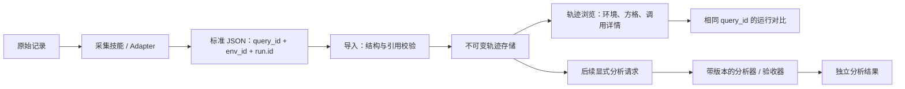

# Trace Hunter：先导入与对比，后触发分析

本篇记录原型阶段的产品与事实模型；当前工程结构和部署边界见 [平台 v0.2](platform-v0.2.md)。

2026-09-09。当前运行输入版本 `trace-hunter/1.1`，集合与 Case 清单版本 `trace-hunter/catalog/1.0`。

## 产品入口：集合 → Case → 运行对比

数据保持三层，常用浏览合并为一个工作区：左侧常驻集合及其 Case 列表，右侧直接显示所选 Case 的输入、运行选择和轨迹。首次进入自动打开一个已有运行的 Case；同集合或跨集合切换 Case 都直接点击左侧条目，不需要返回列表。全局搜索过滤左侧 Case；集合总览和列表保留为可选入口。

运行选择改为紧凑勾选项，首次打开默认选择最多六条运行；页面会话内按 query_id 记住勾选结果，切换 Case 后返回无需重选。数据层的运行身份、对比规则和采集范围保持不变。导入仍为独立弹窗，环境详情和分析按需展开。

交互走查使用现有 Case：从多维表格直接切到 SQLite，再返回多维表格，每次切换从原来的“返回列表＋选择 Case”两次点击降为一次；返回时保留运行勾选。搜索“多轮”只匹配多轮 Case，一键清空恢复完整列表；无运行记录的 Case 直接展示输入与待采集状态，不增加一层空白页面。以上浏览不会触发分析。

集合是 Case 的组织层，Case 是任务定义，运行是一次执行。集合与 Case 定义保存在独立表 `collections`、`case_definitions`、`collection_cases`；原始运行仍保存在不可变的 `runs` 表。一个 Case 可属于多个集合；定义在采集前导入时，即使还没有运行也可浏览。清单协议与约束见 [集合与 Case 清单协议](../catalog-protocol-v1.md)。

页面路由：`#/` 自动进入最近浏览或默认 Case；`#/collections/{id}` 自动进入该集合最近浏览或首个已有运行的 Case。自动定位使用 replaceState，避免增加额外返回步骤。`#/overview` 为集合总览，`#/collections/{id}/overview` 为可选 Case 列表，`#/collections/{id}/cases/{query_id}` 为直接可分享的 Case 对比地址。集合、Case 和运行的数据协议不因导航简化而改变。

Case 的固定单轮 / 多轮输入，不等于运行中实际发生的用户轮次。后者可能包含临时澄清和压缩续接；不能从工具数量推断，也不能用它改写 Case 身份。

## 从第一性原理确定身份

一次运行需要回答三个不同的问题：执行的是哪个任务、处于哪个环境、这是第几次尝试。因此把身份拆成三个字段：

| 字段 | 定义 | 使用规则 |
|---|---|---|
| `run.query_id` | 任务身份 | **相同 query_id 即可进入同一对比组**；不按 query 文本、模型名或环境做相似匹配 |
| `run.env_id` | 执行环境配置身份 | 表示客户端 / harness、工具配置等环境；不同 env_id 可以在同一 query_id 下对比 |
| `run.id` | 本次运行身份 | 同一任务、同一环境可以运行多次，每次都有新 ID |

模型仍记录在 run 上。env_id 不等于模型名，也不等于沙箱类型。由实验组织者 / 采集器分配 query_id 与 env_id，平台不凭聊天文字猜测它们。

## 导入与分析分别触发



导入、列表、单条浏览、对比与阶段切换都不会调用分析器，也不会创建分析结果。方格只对原始时间字段做展示投影：端点相减、按已记录调用顺序展示，缺失保留 null，前置间隔明确标为估算。

分析在后续显式触发，负责请求去重后的累计 token、时间占比、瓶颈、验收、评分与训练轨迹筛选。已有确定性分析实现保留独立入口，当前页面通过“生成三项分析”手动触发，分别展示成本、轨迹、时间。分析结果的键为 `输入 hash + analyzer_version + scope`，不覆盖输入。

## 环境与时间变化

`environment.isolation` 只有三种取值：`sandbox` / `non_sandbox` / `unknown`，页面显示沙箱 / 非沙箱 / 未知。

沙箱描述隔离方式，联网是另一项事实。沙箱也可能允许外部联网，因此单独记录 `network_access`（allowed / blocked / unknown）。同一个 env_id 的配置不变，并不说明外部世界不变。

尤其是非沙箱或允许联网的运行，外部工具版本、服务响应、权限及数据会随执行时间变化。协议为每次运行保留环境观测时间 `observed_at`、工具版本 `tool_versions`、快照 `snapshot_id` 与说明 `notes`。这些信息供后续分析判断可复现性，不作为阻止同 query_id 对比的条件。配置主动变更时分配新 env_id；远端数据自然变化时保留 env_id 并记录当次时间和状态。

未采集的属性填 unknown / null，不从应用名或「在虚拟机里」推断已实现隔离。历史样本目前没有完整环境声明，因此显示未知。

## 事实模型

- Phase：task / setup / export；默认展示 task，导出阶段可切换查看。
- Span：model / tool / wait / agent，保存时间、输入、结果、来源与请求身份。
- Link：invokes 表示模型触发工具；parent_id 表示运行时包含关系。
- Evidence：产物、断言与备注，留给后续验收使用。

时间单位统一为相对任务起点的毫秒，未知不补零。共享请求的 token 不能复制到每个工具上累计；输入已包含缓存子项，输出已包含 thinking 子项。这些是事实口径，具体汇总在分析触发后完成。

## 代码边界

```text
schemas/trace-v1.schema.json     当前 1.1 输入协议
schemas/trace-v1.0.schema.json   旧协议兼容
src/trace_hunter/identity.py    query/env 身份、旧版本展示映射
src/trace_hunter/catalog.py     集合清单校验与 Case 展示元数据
schemas/catalog-v1.schema.json 集合 / Case / 单轮与多轮输入协议
src/trace_hunter/protocol.py    导入结构与引用校验
src/trace_hunter/adapters.py    原始导出格式转换
src/trace_hunter/timeline.py    调用展示投影，不生成分析结果
src/trace_hunter/storage.py     不可变导入、按 query_id 对比、显式分析入口
src/trace_hunter/analysis.py    后触发的分析实现
apps/trace-platform/            导入、类型切片与可切配色的浏览 demo
```

旧 1.0 输入和 hash 保持原样。浏览时将旧 task_key 映射为 query_id，以 legacy 前缀标识旧环境分组，并明确显示未知属性；不把兼容映射写回原始数据。新的采集应直接产出 1.1，明确提供 query_id、env_id 和环境声明。

当前仍为只监听本机的单用户工具。后续逐步增加采集技能、显式分析任务、业务验收与评分；现阶段先把导入和可对比的事实结构稳定下来。

## 三类分析的职责

| 类别 | 确定性结果 | 额外输入 |
|---|---|---|
| 成本分析 | 请求级 token、缓存、thinking 子项；有价格时估算金额 | 有来源和版本的模型分项单价 |
| 轨迹分析 | 技能加载 / 显式调用、工具调用分布、错误及来源定位 | 后续大模型评审需要 judge 模型、rubric 和证据协议 |
| 时间分析 | 逐调用时间、已测模型区间、工具并集、占比和未拆分时间 | 进一步区分输出、等待需 first-token 等计时证据 |

分析结果彼此分开。LLM 轨迹评审未来只追加带证据的解释，不改变 token 或计时事实。三类分析都在导入之后显式触发。

[多轮会话、用户轮次、模型请求与压缩续接研究](../research/multi-turn-traces.md) 给出下一版协议建议；当前协议不会把模型请求次数叫作用户轮数。
