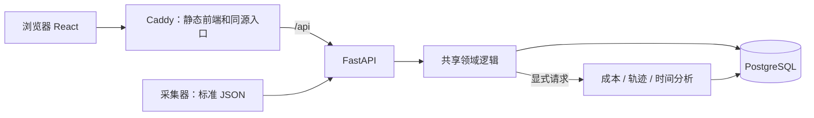

# 平台 v0.2：前端、API、数据库独立

历史拆分记录。当前 Web、API、Backend、PostgreSQL、Plugin 与远程服务的模块和镜像边界见[服务边界](service-boundaries.md)。

产品仍是「集合 → Case（query_id）→ 多次运行对比」。本次把原型拆成三个独立进程，保留已经确认的操作路径与输入协议。

```text
apps/web/                  React、TypeScript、Vite、Ant Design
apps/api/                  FastAPI 路由、HTTP 边界、服务启动
src/trace_hunter/          校验、身份、展示投影、分析与存储业务
contracts/                OpenAPI + 输入 JSON Schema，单一契约来源
db/migrations/            有序、带校验和的 PostgreSQL SQL 迁移
deploy/                   Caddy 和三个 systemd 用户服务
scripts/                  契约生成、数据迁移、部署、依赖校验
apps/trace-platform/       保留的旧版静态 demo
```



## 职责

- 前端负责导航、勾选、切片器、方格和详情。接口类型由 OpenAPI 生成。`dev:mock` 使用合成响应，生产构建使用真实 API。
- API 负责体积限制、错误语义、来源检查与调用领域逻辑，不提供页面文件。共享逻辑继续被采集器、转换脚本和兼容 demo 使用。
- PostgreSQL 保存不可变运行、集合、Case、成员关系和独立分析缓存。UI 状态不写回原始轨迹。数据库与 API 都只监听回环地址，对外入口仍为 8766。

`query_id` 是唯一对比分组条件，`env_id` 是环境配置身份；模型、harness、沙箱和联网状态分别保存。同一 Case 在多个集合出现仍是同一个任务定义。导入相同 ID 和内容为幂等，同 ID 不同内容返回 409。

## 数据与并发

原始 canonical JSON 用 TEXT 保存，以原有 digest 为事实身份。PostgreSQL 的 `query_id`、`env_id` 列用于查询，JSONB 只存可索引的派生状态；不通过 JSONB 重序列化计算原始 hash。旧 1.0 输入仍保持原文，展示兼容映射不写回。

数据库唯一约束和事务保证并发导入幂等；集合及 Case 冲突整批回滚。连接池由 API 持有。迁移使用事务和 advisory lock，同版本 SQL 校验和变化会拒绝执行。

SQLite → PostgreSQL 使用一致快照，逐表保留原文、ID、时间和分析缓存，迁移后逐表校验内容指纹。目标只能为空库或完全相同的数据；不会覆盖一个已有不同数据的数据库。SQLite 后端继续支持本地采集与历史测试。

## 分析边界

导入与浏览只校验和投影，用户点击后才运行三类确定性分析，并独立缓存。缺失时间和 token 仍是未知；模型前置间隔标为估算，工具并行按区间并集计算墙钟占比，缓存与 thinking 子项不重复相加。

当前不添加大模型评审、任务队列、对象存储或权限系统。以后耗时的 LLM 分析可单独接 worker，保持输入不可变、结果带版本的边界。

## 验证入口

共享 HTTP 契约测试同时覆盖旧接口和 FastAPI；专用 PostgreSQL 测试覆盖并发导入、事务回滚、幂等和迁移。浏览器验证 Case 切换、运行勾选恢复、技能方格、调用详情、显式分析和导入。包版本及构建步骤遵循 [至少 7 天的发布冷却期](../security/dependencies.md)。
