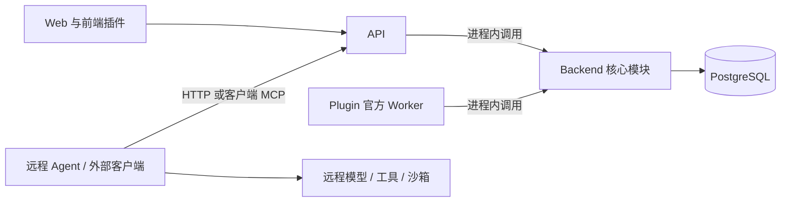

# Web、API、Backend、PostgreSQL、Plugin 与远程服务

状态：模块职责与容器角色已定义。生产仍使用原 systemd 部署，未切换容器。模块、镜像、运行进程分别描述，当前保留一个仓库。

平台总体目标与 Backend 的训练数据领域以[训练轨迹基础设施](training-data-platform.md)为准：统一查询、分析结果、回放验收、数据发布、消费账本及模型反馈。本文聚焦部署和进程边界。

## 职责与目录

| 模块 | 负责什么 | 当前实现 / 发布单元 |
|---|---|---|
| Web | 页面、交互、可视化、UI 插件宿主 | `apps/web`；Web 镜像，Caddy 提供静态文件和统一入口 |
| API | 对外查询、导入、任务与结果接口；HTTP 参数和错误语义 | `apps/api`；API 镜像，消费 `contracts/openapi.json` |
| Backend | 轨迹校验、集合/Case、查询投影、任务状态、结果验证与存储 | `src/trace_hunter`；共享 Backend 基础镜像，模块由 API 和官方 Worker 调用 |
| PostgreSQL | 原始轨迹、集合、插件注册、任务、尝试和派生产物 | 官方 PostgreSQL 镜像与独立数据卷；`db/migrations` 管理演进 |
| Plugin | 渲染器、筛选器、分类器、评分器的版本化实现 | `plugins`；浏览器部分进入 Web，官方计算部分进入 Plugin 镜像 |
| 远程服务 | 独立运行的 Agent / 外部执行器，及其使用的模型、工具、沙箱 | 服务方独立部署，通过平台 HTTP 或客户端 MCP 桥接入 |

`skills/` 是 Agent 的操作指导和适配脚本；`contracts/` 是共同协议。可选 `agent-tools` 镜像携带 skills、导入 CLI 和 MCP 桥。它是接入工具，Plugin 是平台扩展能力，两者职责不同。

API 和 Backend 当前是模块边界：一次 HTTP 请求直接调用共享核心。没有新增内部 RPC、第二套数据 API 或额外网络服务。Backend 镜像也用于一次性数据库迁移。

## 依赖关系

这是代码与调用关系。实际网关由 Web 镜像中的 Caddy 提供，远程请求仍经过网关认证。Backend 模块分别存在于 API 和 Plugin 进程中。

镜像构建关系为：`Backend → API / Plugin / agent-tools`；Web 独立构建；PostgreSQL 使用官方锁定镜像。运行启动关系为：`PostgreSQL 就绪 → 迁移完成 → API 与 Plugin → Web`。远程服务自行启动，不进入平台启动依赖。

现在 API / Plugin 的独立镜像基于相同内容层和依赖集合，默认保持同一发布版本。它们提供独立进程入口，还没有把全部源码、插件包和 Python 依赖裁剪成互不重叠的包。已发布插件的校验目前仍引用部分 Web 源码；该关联保留，后续按包协议演进处理。

## 远程查询与执行

两种访问场景使用同一平台协议，认证范围不同：

| 场景 | 已有入口 | 身份与边界 |
|---|---|---|
| 查集合、Case、轨迹与已有结果 | `GET /api/collections`、`/cases/{query_id}`、`/runs/{run_id}`、`/plugin-runs/{batch_id}` | 操作员 Basic 认证；当前不是专门的只读账号，拥有管理能力 |
| 查询一个任务的固定输入 | `/api/plugin-jobs/{id}/input`、`query`、`record-read` | 单任务 Bearer 与 attempt；查询受绑定输入范围限制 |
| 领取、续租、结果回写 | `/api/plugin-jobs/{id}/claim`、`heartbeat`、`results`、`fail` | dispatch / lease 凭据；结果与固定输入、插件版本及尝试绑定 |

远程读取已有数据不要求先启动模型，也不触发新分析。需要计算时，操作员显式创建任务并交付单任务凭据；远程 Agent 领取并分页读取，执行后提交类型化结果，Web 再读取已保存结果。调用例子见[对外 API](../api/external-access.md)。

当前 MCP 是 Agent 所在环境启动的 stdio 桥，不是公共 HTTP MCP 服务。远程服务的模型和工具凭据由该服务保管。平台不向外部插件提供 PostgreSQL 凭据；官方受信任 Worker 当前通过 Backend 直接访问数据库。Plugin 容器不是任意第三方代码的沙箱。

## Plugin 的三种位置

- 浏览器插件：renderer / filter，随 Web 发布，通过宿主读取数据、共享选择状态，卸载时释放资源。
- 官方计算插件：classify / evaluator，由独立 Plugin Worker 运行已发布并核验的实现，写入派生产物。
- 外部计算插件：由远程 Agent 或独立执行器运行，使用任务 API；注册 Manifest 不自动启动外部实现。

一个插件包可以同时包含浏览器贡献点和计算贡献点，因此插件包不等同于单一镜像。镜像承载实现，Manifest 声明能力和版本，结果协议负责跨插件消费。输入事实和 digest 始终保留，插件结果独立存储。

## 当前远端核对

2026-09-11 只读检查 `10.37.195.183`：

- `trace-hunter-web`、`trace-hunter-api`、`trace-hunter-worker`、`trace-hunter-db` 均为 active / running；机器架构 x86_64。
- 发布记录提交为 `8a296aa7ef9dce37dfd053faf867f618e1e07e45`，Web / API / Worker 使用 `classifier-workspace-8a296aa` 发布目录。
- 健康接口返回 PostgreSQL 正常；插件目录中的现有贡献点宿主为 browser / builtin。该目录没有显示已注册的外部执行器，不据此推断其他机器是否运行 Agent。
- 本次没有修改服务配置、读取凭据、启动分析或写入远端数据库。

## 后续按需要扩展

- 远程服务绑定：单独定义 endpoint、鉴权引用、健康状态、并发与启动/取消能力；不把环境地址和秘密写进不可变插件 Manifest。
- 广域只读访问：增加受限服务身份、数据范围与审计；已有操作员账号不能冒充只读凭据。当前任务凭据只覆盖被授权的单个任务。
- 独立发布：协议兼容检查、客户端版本范围、插件包分发和按执行器拆依赖；远程模型与沙箱保持由服务方管理。

上述三项是后续设计，不是本轮已上线能力。现有接入流程和启动命令见[容器部署](../../deploy/containers/README.md)。
