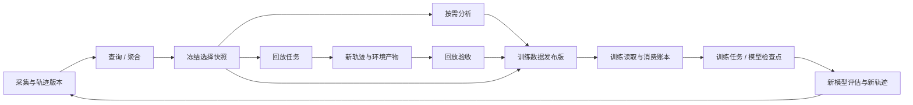

# 训练轨迹基础设施

状态：训练数据生命周期的目标架构与离线协议草案，未上线。本文扩展[平台主设计](platform-contract-and-plugins.md)和[轨迹 RFC](../rfcs/0002-general-trajectory-contract.md)，作为后续训练能力的主设计；[镜像划分](service-boundaries.md)是部署实现。

Trace Hunter 管理从执行事实到模型训练使用记录的全过程。人通过 Web 检查和操作，Agent、回放执行器、分析插件与训练程序通过同一资源协议查询、计算和提交证据。平台自身不负责模型优化器或 GPU 训练循环。

## 1. 完整链路

每个箭头保存明确的版本和来源引用。不是所有训练用途都强制经过同一种回放；数据发布策略决定哪些检查必须通过。执行结束、验收通过、训练可用、被训练使用分别记录。

## 2. 核心对象

| 对象 | 含义与必须绑定的信息 |
|---|---|
| TraceRevision | 原始执行事实的不可变版本、来源、实际模型输入、工具调用、会话/压缩/恢复关系及采集缺口 |
| SelectionSnapshot | 一次查询最终选中的具体轨迹/记录版本；查询指纹、解析时间、选择清单及摘要 |
| AnalysisArtifact | 针对哪个版本和范围，由哪个分析器、配置、规则/模型版本生成；指标、分类、问题、证据及计算用量 |
| ReplayJob / ReplayResult | 源轨迹、回放方式、环境初态、执行器版本、尝试、输出的新轨迹和环境产物 |
| ValidationReport | 对哪个回放/产物，按哪个验收策略执行了哪些检查；结论和证据。缺数据单列 |
| DatasetRelease / SampleManifest | 冻结的训练数据成员、来源片段、转换器、用途 profile、验收策略与报告；模型训练样本可对应一条轨迹中的多个片段 |
| ConsumptionLedger | 哪个训练任务/尝试在什么 epoch/step 读取或确认使用了哪个发布版的哪些样本；幂等回执和检查点引用 |
| ModelRun / Checkpoint | 外部训练任务、训练配置版本和检查点引用，关联所用发布版及消费记录；后续评估能反查数据来源 |

通用引用包含 `kind + id + revision + digest`。查询可以选择 latest，执行、验收、发布与消费必须解析为固定引用。大成员列表使用带摘要的 manifest；正文、图片、环境快照、token 数组与检查点使用内容引用。

一条轨迹能产生多个训练样本，一个样本也能有多项来源。SampleManifest 必须记录 source trace/record 范围、transform 版本、模板/tokenizer 版本和输出摘要。仅保存 run_id 无法追溯实际送入训练的内容。

## 3. 回放与验证

三种执行模式分开报告，页面时间线浏览不算执行回放：

| 回放方式 | 固定什么 | 能验证什么 |
|---|---|---|
| recorded_tools | 工具录制结果与执行器/回放器版本 | 离线控制流、解析器、数据处理；不证明外部系统实际状态 |
| reexecute_actions | 原工具动作、初态快照、工具/执行器版本、外部依赖策略 | 在指定环境执行这些动作后的状态与产物；不代表重新生成了模型决策 |
| regenerate | Case / 交互政策、初态、harness、模型配置与版本 | 重新运行模型后的新轨迹及效果；结果是新运行，不要求逐 token 相同 |

环境规范应包含镜像与依赖、数据/文件初态、工具版本、时钟/随机性政策、网络与外部服务策略、secret 引用。部分回放还需要对应检查点与前置状态。环境缺失、不可恢复或权限不足时返回 `blocked` 及结构化原因；业务逻辑未通过验收才记为失败。

在线外部工具的数据会变化，即使镜像相同也不能声称确定性回放。回放记录实际环境观测、调用返回、状态 diff 和新 TraceRevision；原轨迹不覆盖。补采、修复、重新生成分别保留 derivation 类型和父引用。

验收独立于执行器：`passed / failed / insufficient_data / not_applicable`，每项检查引用证据和策略版本。不同模式的验收不能相互替代。判断“可以用于 SFT / RL”再使用对应的训练准入策略，不能从工具无报错推断。

SFT 需要核实真实请求上下文、工具定义、响应、转换与目标 token 范围。严格 RL 还需要实际采样模型版本、原 token IDs/logprobs、tokenizer/template、mask 和奖励归因。不同训练算法有独立 profile；环境验收通过不能补齐缺失的 token 证据。已有 trace-v2 原型尚未实现这些严格训练出口。

## 4. 消费是有范围的账本

原轨迹不增加全局 `consumed=true`。读取、导出、送达与训练确认分别记账：

1. 查询或读取只产生访问审计，不改变训练消费状态。
2. 训练任务领取某发布版的分片，登记 reservation、租约和 attempt；领取不代表消费。
3. 导出/下载产生 delivery 记录，不能算已用于训练。
4. 训练程序完成约定的 step/checkpoint 后，提交 `trainer_committed` 回执，附实际样本清单、epoch/step、计数和检查点/训练日志证据。
5. 错误回执通过引用原回执的纠正事件处理，原事件保留。租约超时不能凭已下载推断训练完成；训练状态不明时保留待对账。

回执表达训练端报告的事实，平台可核验绑定和证据，不能仅凭 ACK 证明样本对权重产生了效果。逻辑回执身份为 `(consumer_run_id, consumer_attempt, receipt_id)`：同身份同内容重传幂等，不同内容冲突。不同 epoch 的真实重复使用保留，多个模型任务可以合法消费同一发布版。

“未消费”查询必须指定 consumer namespace / 训练任务 / 发布版和重复使用政策；不存在全局通用的未消费含义。样本派生、跨发布版重复及训练/验证集交叉使用通过 lineage 与版本化去重/污染检查处理。检查结果和发布策略也记录版本。

样本被隔离、资格撤回或来源修复时，追加相应状态事件并阻止后续不符合策略的领取；保留已发生的消费。通过血缘定位受影响的数据发布版、训练任务和模型检查点，不能靠改写原轨迹来消除已训练历史。

网络和 Worker 使用至少一次交付、租约、attempt 隔离与幂等回执。数据库原子领取防止同一分配范围重复占用；旧 attempt 无权提交新 attempt 的结果。训练端实际消费与平台账本之间需要持久 checkpoint、可重试回执和对账流程，不宣称跨系统 exactly-once。

## 5. Agent 查询与分析结果

所有关键能力应有结构化资源与动作接口。Web 是这些接口的一个客户端，Agent 无需截图、读图或解析一篇自然语言报告才能取得数据。

| 能力（候选工具名） | 语义 |
|---|---|
| `platform_describe` | 发现版本、资源、字段、支持的过滤/聚合、权限、效果和数据要求；只公布真正可用的能力 |
| `trace_query` / `trace_aggregate` | 结构化过滤、分组统计、稀疏字段、稳定分页；结果附范围、缺失覆盖和单位 |
| `trace_get` / `record_read` / `artifact_read` | 按版本取详情或内容切片；返回引用、摘要、截断状态与下一页 |
| `analysis_query` / `analysis_get` | 检索、读取已有分析结果，包含输入范围、算法/规则版本与证据；不创建计算 |
| `analysis_request` | 缺少匹配结果时显式申请计算，精确匹配输入/配置后复用，返回任务引用 |
| `selection_freeze` | 把候选筛选结果锁定为不可变成员快照，后续任务使用同一范围 |
| `replay_preflight` / `replay_request` | 检查回放条件、提交回放；预检不启动工具或模型 |
| `validation_request` / `validation_get` | 显式验收或读取已有验收；执行状态与验收结论分离 |
| `dataset_release` / `dataset_get` | 按固定策略与转换版本发布训练样本清单，读取发布版和分片 |
| `consumption_claim` / `consumption_ack` / `consumption_query` | 领取、幂等确认、查询训练消费和待对账状态 |

这张表是目标接口，不能将工具名作为当前 MCP 已上线能力。现有服务能力见[对外 API](../api/external-access.md)。查询正文可使用 POST 承载复杂条件，但仍声明为只读；创建任务、发布数据、领取和确认消费是写动作，有独立权限和幂等键。

“查询分析结果”必须可回答：基于哪版输入、覆盖多少记录、缺哪些证据、何时由哪个版本生成、能否用于当前筛选。源版本或配置变化后，旧报告仍可读，但不再满足新计算的精确匹配。自然语言总结只是分析产物的可选展示，结构化指标、facets、findings 和 evidence 是可查询数据。

批量统计在数据服务端执行。响应包含 `items / next_cursor / snapshot_ref / coverage` 等结构信息；未知时间/token 与 0 分开。分页使用固定快照及稳定键，过滤条件变化后重新创建查询范围。多标签计数、不同模型请求、缓存 token、并行耗时遵守各自计量口径，不能从页面方格直接累计。

空查询结果是合法结果。查询还应返回数据与索引水位，索引尚未完成时报告覆盖不足；冻结训练选择时按发布策略要求等待索引完成或显式接受部分范围，不能把索引延迟解释成没有这些轨迹。

服务身份按项目/数据范围授予 `trace.read`、`analysis.read/request`、`replay.request`、`dataset.publish/read`、`consumption.ack` 等能力；凭据不混在轨迹正文。当前操作员 Basic 不是只读服务身份，现有 job Bearer 也不是全平台数据查询凭据。正式实现需补足服务身份和审计。轨迹正文是待处理数据，不成为 Agent 的系统指令。

## 6. 服务与存储

技术选型、进程与数据权威边界见[后端目标架构](backend-target-architecture.md)，依据见[Langfuse / Discover Traces 研究](../research/langfuse-traces-backend-architecture-20260912.md)。以下是目标能力，不代表已新增生产服务。

控制面管理资源目录、权限、固定版本、任务、发布和账本；执行面运行采集器、分析器、回放器、验收器、样本转换器和外部训练程序。训练任务可以部署在其他集群，回放和分析可使用不同资源池。

Backend 内部按领域分成：Trace/Query、Artifact/Lineage、Job、Replay/Validation、Dataset、Consumption。开始时可在现有 FastAPI + PostgreSQL 工程中以模块和独立 Worker 实现；根据实际吞吐、资源与发布需求独立部署。镜像数量不定义领域边界。

| 存储 | 内容与责任 |
|---|---|
| PostgreSQL | 身份/版本、权限、查询索引、任务/租约、数据发布、成员索引、消费回执；唯一约束和事务保证账本一致 |
| 内容存储 | 原始日志、请求/响应、多模态附件、环境快照、训练分片、详细报告；引用带 digest/大小/类型，线上使用受控对象存储 |
| 分析投影 | 按版本可重建的筛选/统计索引；初期在 PostgreSQL，超出实际负载后引入列式分析存储 |

目标表组：`trace_revisions / selection_snapshots`、`artifacts / lineage_edges`、`jobs / attempts / job_events`、`replay_results / validation_reports`、`dataset_releases / sample_manifests / shards`、`consumer_runs / consumption_claims / consumption_receipts`、`model_checkpoints`。这些是待迁移设计，未创建生产表。

跨数据库与对象存储通过先完成不可变内容、再事务登记引用的方式发布；未完成的上传不能成为 ready 产物。任务通知使用事务 outbox 或同库可轮询队列，执行器幂等重试；训练大文件通过清单与分片读取，不塞进 LLM 工具响应或单个数据库事务。

## 7. 平台核心与插件

固定资源身份、查询语义、任务/attempt、不可变输入、结果绑定、发布准入执行、消费账本和权限属于平台核心。它们保证多个插件和训练程序对同一份数据有一致理解。

算法和环境相关实现可插拔：质量/阶段分类器、奖励与验收器、Base/浏览器/代码回放器、训练样本转换器、UI 渲染器。插件声明输入、输出、要求和实现版本；核心验证结果并维护生命周期。

现有稳定插件协议只覆盖 renderer/slicer/evaluator。回放器和训练转换器将有新的能力定义与执行合同，不能为了复用当前页面而伪装成评分任务；是否升级 Manifest 主版本在冻结合同前决定。

## 8. 当前缺口与实施顺序

已有：不可变导入、Case 对比、基础统计、插件版本/派生产物、异步计算与单任务 HTTP/MCP。已有草案：细粒度轨迹/上下文、环境规范、内容引用和通用资源中枢。

尚缺：统一的跨轨迹/跨分析查询与服务身份、冻结选择快照、可执行回放与独立验收、训练发布/分片、消费账本与对账、训练任务和模型检查点的反向血缘。当前系统不能宣称训练闭环已完成。

建议按一个可验收的纵向流程建设：

1. 查询与结果读取：固定输入版本、分页/聚合、analysis artifact 索引、服务身份、selection snapshot。
2. 回放与验收：先接一种真实环境，外部执行器领取任务，产出新轨迹和验收证据；验证超时、缺环境、失败和未知。
3. 训练发布与消费：选一种训练 profile，生成固定清单，接一个训练端，完成领取、训练确认、重传去重、跨 epoch 和跨任务查询。
4. 反馈：从新模型检查点反查数据与源轨迹，关联新一轮评估/采集。再扩展环境、插件和吞吐。

协议对象、合成流程和反例验证见[训练生命周期草案](../../contracts/drafts/training-lifecycle-v1/README.md)。先验证“查询不会消费、读报告不会启动模型、回放生成新版本、验收与执行分离、训练回执不会重复计数”这些语义，再决定服务拆分和存储扩容。
