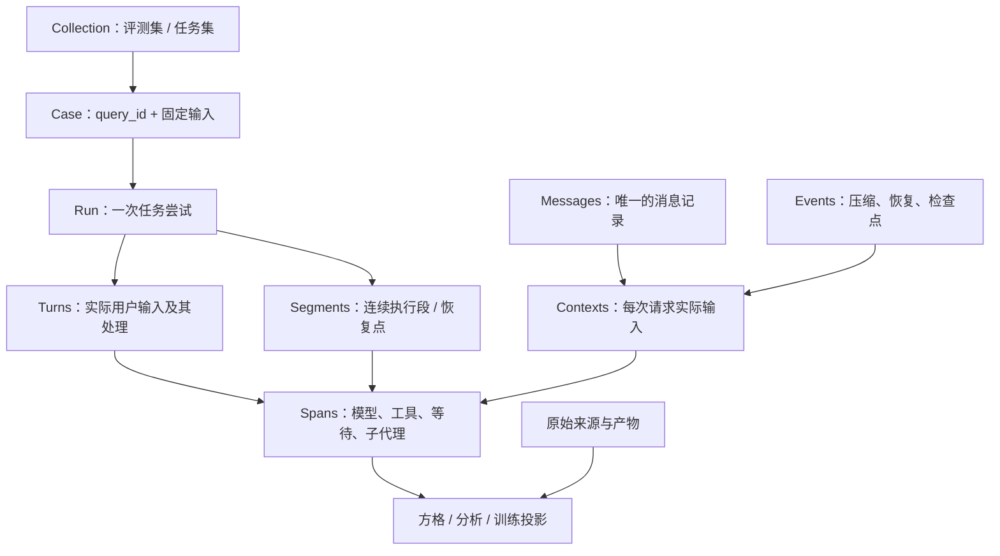

# RFC 0002：通用 Agent 轨迹输入与互操作方法

状态：**设计草案，供样例与适配器验证；不是线上导入协议。** 2026-09-10。线上继续接受 1.0 / 1.1，集合继续使用 catalog/1.0。本 RFC 的决定属于 Trace Hunter 设计，不代表引用项目的统一标准。

平台范围和后续建设以[平台主设计](../architecture/platform-contract-and-plugins.md)为准，涵盖完整轨迹、环境要求、数据库与评测插件。接入工程验证见 [Agent 友好的接入设计](../architecture/agent-friendly-ingestion.md)，包含轻量输入、发现/错误协议、状态机及 8 份来源验证。来源能力不限制平台目标。

## 1. 建议

采用「**任务定义 + 不可变执行记录 + 分用途投影**」。执行记录以调用图、消息、实际请求上下文及离散事件组成，导出成一个可携带的 JSON 包；实时采集以后使用同一语义的分批事件入口。方格、成本、时间、质量报告、SFT/RL 样本都从这份记录派生。

互操作优先参考 ATIF 的轨迹文件、OpenTelemetry / OpenInference 的调用语义、Inspect 的细分事件；不要直接把任一供应商格式改名作为平台标准。Catalog 与运行数据继续分开；`query_id` 相同即允许比较，`env_id` 不承担任务、模型或沙箱类型的身份职责。

先明确消费问题，再确定必须采集的事实，最后用不同 harness 的真实记录做适配验证。Schema 是这套方法的机器检查部分，还需要跨记录约束、统计约束和信息损失报告。

## 2. 论文给出的必要信息

| 论文 | 核实的内容 | 本项目采用的设计推论 |
|---|---|---|
| [τ-bench，2024，§2–3](https://arxiv.org/html/2406.12045v1) | 任务包含用户与工具的动态交互；按最终数据库状态及相关输出验收，并研究多次尝试的一致性 | 分开任务定义与真实对话；保留环境初态、最终产物及验收证据；工具返回成功不等于任务成功 |
| [Agent Lightning，2025，§3.1](https://arxiv.org/html/2508.03680v1) | 用调用输入、输出及评价构建训练 transition，将执行与训练解耦 | 每次模型调用必须能定位当时的真实输入；评分是独立产物，不能改写采集事实 |
| [Agent Lightning v1.0，2026，§3](https://arxiv.org/html/2608.17528v1) | harness 的摘要、子代理、重分词会破坏相邻请求的 token 前缀连续性；训练需保持动作实际采样时的输入 | 不能将整段聊天直接拼成训练样本；SFT 与严格 RL 分别检查上下文和 token 级证据 |

论文支持的是上述问题与原则，不证明一个 Schema 能自动接入所有 agent，也不证明可从日志还原未观测的内部状态。未把论文实验成功率当作本平台收益预测。

## 3. 工程实现核查

源码固定到访问时的 commit，具体文件及 SHA-256 见 [来源清单](../research/trajectory-sources-2026-09-10.json)。只下载阅读，没有安装或执行上游代码；本次不新增运行时依赖。

| 项目 / 固定版本 | 读到的机制 | 采用与边界 |
|---|---|---|
| [Harbor / ATIF，191d1b989bbb](https://github.com/harbor-framework/harbor/blob/191d1b989bbba1d77c2db23e17aec308d7c08046/rfcs/0001-trajectory-format.md) | step、工具结果关联、逐步 metrics、续接和 copied context；v1.7 另分 run 范围 session 与文档 trajectory ID，允许 llm_call_count 表示聚合 | 建 ATIF adapter。一个 step 未必是一轮用户输入或一个请求；没有每个工具的执行时间时不得从 step.timestamp 补出 |
| [OpenTelemetry GenAI，0c8759497519](https://github.com/open-telemetry/semantic-conventions-genai/blob/0c87594975195608dc91b3f702e250a7b240c151/docs/gen-ai/gen-ai-spans.md) | 模型请求与 agent/tool 语义、模型身份、内容及 usage 属性；GenAI 仍在演进 | 将版本固定在 adapter。核心 Trace Hunter ID 保持独立，保存外部 trace/span ID 映射；未采集的会话身份不猜造 |
| [OpenInference，34b19a6a1391](https://github.com/Arize-ai/openinference/blob/34b19a6a13918b452b8bc15ad9fc9c6b306dafa7/spec/tool_calling.md) | 模型输出 tool_call.id 与后续 tool result 的 message.tool_call_id 关联，保留工具定义 | 明确“模型提出调用”“实际执行”“返回消息”三个对象；结果通过 ID 关联，不能只找时间上最近的模型 |
| [Inspect，10cab1265e86](https://github.com/UKGovernmentBEIS/inspect_ai/blob/10cab1265e86c2f6f9aa5728052494a97059e968/src/inspect_ai/event/_model.py) | ModelEvent 记录 input、tools、config、raw call、completed；ToolEvent 区分 working_time，保留截断；Compaction / Branch / Checkpoint 为事件，message pool 减少重复历史 | 消息、请求上下文、事件分别保存；截断和工作耗时需有明确口径，不能仅保存最终回复 |
| [Langfuse，2c44151e2a1f](https://github.com/langfuse/langfuse/blob/2c44151e2a1fe8736b3e73b087c761ae2a1edabc/packages/shared/src/server/otel/OtelIngestionProcessor.ts#L506) | OTLP 经队列处理；对 AI SDK agent 的聚合 usage 特别处理，避免与子模型调用重复 | 先解决调用和计费归属，再汇总；“把树上 token 相加”不是通用算法 |
| [Agent Lightning v1，218f1f7c0bac](https://github.com/microsoft/agent-lightning/blob/218f1f7c0bac0800de4d5a4e5e6f61cf7b5038b4/agentlightning/schemas.py) | 当前 schemas.py 的 Event 用 rollout/attempt 和列表位置组织；timestamp 由 store 写入，model_request 保存原请求响应；routes/events.py 从 token ID 和 logprob 生成训练输入 | 保留 raw request/response；不能把该 timestamp 直接当执行开始，也不把单进程列表位置当成多来源重传的稳定身份 |
| [LangGraph，e539ac122f412](https://github.com/langchain-ai/langgraph/blob/e539ac122f4126f6dd850581c1494948cf620e31/libs/checkpoint/langgraph/checkpoint/base/__init__.py) | checkpoint 有 channel_values、channel_versions、versions_seen、parent_config、pending_writes；thread 可跨多次 invocation | 续接记录 checkpoint 引用及执行段；仅有聊天摘要不等于可恢复的执行状态，checkpoint 也不自动恢复联网环境 |

一个实际的版本陷阱：Agent Lightning 搜索结果仍可能展示旧的 Span / sequence_id 文档，但本次固定 main 已采用 Event。上表按下载源码描述，不把旧文档混成同一实现。Langfuse 的 session 可组织多个 trace，每个 trace 常是一次交互；不能与本平台跨多轮的 run 机械一一对应。[数据模型](https://langfuse.com/docs/observability/data-model)

## 4. 通用方法：六步设计与接入

1. **列消费问题。** 对比哪个 Case，哪里耗时，花多少 token，最终任务是否达成，是否可做训练，失败点能否定位。
2. **写事实需求。** 为每个问题列必需字段、来源、未知情形和反例；不用展示需求决定底层身份。
3. **建统一中间模型。** Case / Run 定比较边界；Span 表执行区间；Message / Context 表内容；Event 表瞬时变化；Source 表证据。
4. **逐来源映射。** 一个 adapter 对应确定的来源版本，把字段标为 exact、derived、missing、ambiguous 或 unsupported，并输出损失报告。
5. **做契约验证。** 检查结构、引用、重试、时钟、计费归属、部分采集与原始来源；通过正反样例测试。
6. **按用途准入。** 可画方格、可做时间分析、可回放、可做 SFT、可做 RL 是不同能力，分别判断。先保留可用数据，不以“全部字段齐全”为所有导入的门槛。

每增加一个 harness，工作应主要发生在 adapter 和该来源的契约样例里；不为每个 harness 增加一套主表和 UI。

## 4.1 对当前 1.1 的具体改进

| 当前约束 | 影响 | 草案处理 |
|---|---|---|
| run 只有一个展示 model | 多模型路由和压缩模型的成本可能错配 | 模型身份落到每个请求，分项可覆盖 provider/model |
| 同 run.id 不可变，running 再提交会冲突 | 进行中采集无法自然更新 | run 与不可变 document revision 分开，旧事实与旧分析继续可追溯 |
| phase 与 spans，没有实际 turn/context | 不能还原用户轮次或训练时真实 prompt | turns、messages、contexts 分开；Case 固定输入仍在 catalog |
| 每种 span 共用一组必填字段 | 工具被迫提交模型专用空值，聚合记录不易表达 | 公共字段 + model/tool 条件结构 + 显式 model_batch |
| 全 run 相对时间默认同一基准 | 跨进程和恢复后的时钟无法可靠直接相减 | clocks 与 segments，先按时钟域计算 |
| usage 默认逐请求加总 | 父级重复上报、压缩分项、聚合 step 容易双计 | 明确消费归属，total/components 互斥，记录无法拆分情况 |

保留当前正确的部分：query/env 身份、来源哈希、未知值、工具原始顺序、技能作为独立标记、不可变导入与后触发分析。新增版本是为补齐这些表达能力，不要求重新采集才能浏览旧数据。

## 5. 身份与层次



| 身份 | 定义与规则 |
|---|---|
| query_id | 任务定义；目标、固定输入或约束改变，应分配新版本身份；沿用现有比较规则 |
| run.id | 本次任务尝试；从头再跑新建 run；澄清和恢复继续原 run；fork 产生新 run 并引用父运行与检查点 |
| document.id / revision | 某次不可变采集快照；同 run 的新进度是新文档，不覆盖旧快照；它不增加任务尝试数 |
| segment.id | 一段连续执行；进程恢复后可新建 segment，保存上游 session 和当次环境观测；不会重置累计消费 |
| turn.id | 实际用户输入引发的处理单元；不同于预设 Case turn。中途用户打断可触发新 turn，二者允许有区间重叠 |
| span.id | 一次可辨认的执行观察；agent 父调用与底层 HTTP 是不同抽象层，必须区分是否拥有消费 |
| invocation_id + attempt | 一个逻辑调用的具体重试；provider_request_id 另存，可为空。无法拆开的多请求记录是 model_batch，不伪造多个 request |
| message.id / context.id | 消息产生一次；多个请求可以引用它，但请求实际输入随上下文修剪、摘要、工具定义而变化 |

Session 由外部系统命名，可跨任务、跨执行段，不能当唯一 run ID。内部生成的 ID 必须标明为内部关联，不能冒充真实 provider ID。

## 6. 数据包：小核心 + 可选能力

```text
TraceDocument
  schema_version, document, run, capture
  sources[]        原始文件 / 大内容的定位与哈希、可用性
  clocks[]         独立时钟域，原点与精度证据
  segments[]       执行段，外部 session、恢复点、环境观测
  spans[]          模型请求 / 工具执行 / 等待 / 子代理 / 聚合或未知操作
  tool_calls[]     模型提出的工具调用；可关联零次或多次有证据的执行
  turns[]          可选：实际用户轮次
  messages[]       可选：顺序化内容块、调用提案、工具结果
  contexts[]       可选：实际 request payload 与消息引用
  events[]         可选：压缩、checkpoint、resume、截断、采集缺口
  links[]          可选：invokes、depends_on、retry_of 等有来源的关系
  artifacts[]      可选：业务产物和状态快照的引用
```

每个 span 只强制公共身份、种类、状态、来源；model 与 tool 用不同扩展字段。避免当前 1.1 对每个工具强制填写模型 request_id、attempt、usage:null 等无意义字段。没有观察到模型调用的轨迹仍可导入，capture 必须声明能力缺口。

内容统一包装为 `content={state,value|ref}`，state 为 complete / partial / missing / redacted。`value` 可以是文本、JSON 或有序多模态块；大文本、图像、原始 wire 响应和 token 数组使用引用。外部 URL 只是定位信息，导入器不得自动联网抓取或读取提交者给出的本机路径。

严格字段用于稳定语义；厂商扩展只放 namespaced `extensions`，不偷偷覆盖核心字段。颜色、字母、饼图分组和评分不进入事实 Schema。

## 7. 最容易算错的五个问题

### 7.1 一次“调用”到底是什么

模型返回的 tool call 是执行提案；可能被拒绝、需要审批、重复尝试或根本没有执行。真实工具执行才生成工具 span，结果 message 再引用这个 span / call ID。确定性调度的工具可以没有 invoking model，不能为了画图补一个模型请求。

父子关系表示包围 / 执行范围，因果依赖使用 links。[OTel 的 parent 与 links](https://opentelemetry.io/docs/specs/otel/trace/api/#specifying-links)本来就是不同机制。父工具内调用子代理时，分别记录 tool span 与 agent span，避免将包含的耗时加两遍。

显式 Skill 可能只是读入说明，也可能调用一段流程。保留原名、真实 operation、skill.name/action；Read 上附 S，后续 Bash / Write 各自记录。不把技能自动解释为“成功完成某工作流”。

### 7.2 对话历史不是模型实际上下文

messages 描述发生过的消息；context 描述当次真正发出的 request payload，包含工具定义、system 指令及参数。可用消息池 / 内容引用减少重复存储，但必须能还原该请求的输入顺序和内容状态。

一个请求可能包含用户早前的全部消息，这不增加用户轮数；同一请求被多个观测层记录也不增加请求数。原始响应中的可见 reasoning 内容可以保留其来源；缺失内容不由采集器或分析模型补造。

### 7.3 时间需要时钟域和计时边界

时间统一用毫秒，保留来源原精度。单一时钟域中可记录 request_start、first_response、last_response、request_end；TTFT 是 first_response-start，尾部传输是 end-last_response。TTFT 不是纯思考，first_response 必须写明是首字节、首内容还是首 token。

工具之间的间隔只能做估算展示。多个工具共享一次模型请求时，响应时间可重复显示，不能重复累计。工作时间、排队时间、等待用户必须来自独立证据，unknown 不等于 0。wait.reason 显式区分 human_input、approval、rate_limit、queue、external 与 unknown，不能从名称或空隙长度判断用户等待。

同一时钟域按区间并集计算占用。不同进程 / 恢复段若没有可靠时钟对齐，只报告各域时长和跨域未知状态，不把入库时间强行当执行时间。采集顺序用于稳定回放；并发没有可信全序时保持局部顺序和依赖关系，UI 的排列不宣称是精确发生顺序。

真实数据验证补充：独立上报的 duration 可能与粗粒度端点差不一致。用 duration_basis=source_reported、duration_scope=elapsed/active/unknown 保留它，差异由 adapter 报告；仅派生 duration 才强制与端点一致。原型已用 Doubao 样本验证，不为通过校验而抹掉原始秒数。

### 7.4 Token 与费用只在一个消费层级计数

每次真实请求 attempt 都应计入消费，包括失败重试。规范化 token：input 包含缓存；output 包含 reasoning；子项不再相加。provider/model/version/service tier 与显示名称分开，价格在分析阶段绑定版本和生效时间。

一个请求内存在压缩和正常采样时，usage 只能选择一种 accounting：**total**（明确包含全部步骤的总量）或 **components**（完整或部分分项）。两者不能同时作为可加数。wrapper、agent 或批次总量保留为原始来源或 model_batch，不能与已经覆盖的请求明细双计。流式累计 usage 的中间快照不作为新增请求。

仅从最后一个上下文窗口读到 57.3K 无法还原累计 token。原始供应商用量与转换口径同时保留；父级汇总无法分摊到具体请求时，不用平均数或最大值伪造逐次用量。

### 7.5 压缩、续接与质量评价

压缩事件连接 before_context / after_context，并保留摘要或 opaque block 的引用；生成摘要的模型请求另计费用。恢复新建 segment，记录 checkpoint 和新旧环境观测。fork 的继承内容只作上下文引用，新执行的请求才进入子分支消费。

运行 completed 只表示执行结束。任务通过与否由版本化验收器根据 artifact / 环境 diff / 断言决定。分析结果引用输入文档摘要、scope、evaluator/rubric 版本和证据 ID；数据完整性、任务质量、效率分开呈现。后续可按「完成且验收通过 + 训练所需证据齐全」筛选，再由轨迹评审定位可修复问题；没有依据时标待评审。

## 8. 传输、持久化与版本

第一步继续离线 JSON：新增的 v2 importer 与当前 `/api/import` 明确分版本，不让线上 1.1 validator 静默接受草案。一个完整快照包含可解析的本地引用；缺失内容保留 state，引用失配则报错。集合与 Case 清单继续独立导入。

未来流式入口建议如下（**未实现**）：

| 入口 | 语义 |
|---|---|
| POST /api/v2/imports | 导入不可变完整快照，返回 run/document ID、digest、校验和损失报告 |
| POST /api/v2/runs/{id}/batches | 附 producer_id、batch_id、每 producer 的 sequence、带稳定 record ID 和 revision 的追加事件；同 batch 同内容幂等，不同内容冲突 |
| POST /api/v2/runs/{id}/seal | 声明采集截止点、每 producer 最后序号和缺口；生成不可变 snapshot，sealed 不表示捕获完整或任务成功 |
| GET /api/v2/runs/{id}/timeline?cursor=… | 分页读取投影，分开 captured_at 与 occurred_at |
| POST /api/v2/analyses | 明确 run/document、scope、分析器版本；后触发，不放在采集事务里 |

进程重启须恢复 producer / record 身份，至少一次传输配合唯一约束与事务达到效果幂等；不宣称网络 exactly-once。乱序到达在未封存区暂存，seal 时检查缺口和引用；状态更新用新 revision，禁止无条件覆盖 final usage。完整快照支持后续补采新 revision，旧分析仍绑定旧 digest。

PostgreSQL 先保留不可变输入文档，再建 runs、records、messages/contexts、artifacts、analysis_results 的索引 / 投影；不要求一个 JSON 根节点对应一张表，也不先引入 Kafka / ClickHouse。正文超过阈值再启用内容寻址存储；重复历史减少的是存储字节，不减少真实 input token。

哈希分两种：source SHA-256 是原始字节；平台 document digest 是版本化规范化规则。跨语言 v2 建议采用 [RFC 8785 JCS](https://www.rfc-editor.org/rfc/rfc8785)，并提供一致性向量后再冻结；当前 1.1 的 Python canonical digest 保持原样。本次草案验证器不实现 JCS 或 HTTP 幂等协议，不冒充已落地。

## 9. Adapter 的交付契约

每个适配器交付：来源名与版本、映射表、至少一份脱敏 / 合成可公开 fixture、来源 hash、loss report 和回归断言。输出字段只允许三种有依据的操作：直接映射、按声明公式转换、保留未知；推测性结论留给后触发分析。

| 来源 | 映射 | 无法保证的内容 |
|---|---|---|
| Trace Hunter 1.1 | run/query/env、phases、spans、links、source 逐项迁移；新增原输入引用，保持旧 digest | 不能凭 phase 合成用户 turn；缺失会话、上下文、provider ID 保持 unknown |
| ATIF 1.7 | agent → harness/agent；steps → messages 与 model / model_batch；tool_calls + source_call_id → 提案、执行结果关联；copied context → 引用 | timestamp 单点不提供每工具区间；llm_call_count=null 不计作“一次”；聚合 metrics 不均分 |
| OTel / OpenInference | trace/span ID → 外部身份；parent 与 links 分开；LLM input/output、tool_call ID 映射；native ns 保存在 source | 普通 OTel 可能只采样一部分，且不含完整 prompt；span tree 不自动等于用户多轮或可恢复状态 |
| Inspect | ModelEvent/ToolEvent → 对应 span；实际 input/tools/config → context；compaction/checkpoint/branch → event | retries 只有计数时，不补每个失败请求的时间、token；仅 working_time 不能当完整调用耗时 |
| Agent Lightning v1 | rollout/attempt → run/segment；model_request → 模型记录及原始请求；reward → 独立来源的评价证据 | store timestamp 不映射执行 start；retry_count 不展开假请求；当前 event 列表位置只在确定来源快照范围内稳定 |

loss report 至少包含 `{source_pointer, target_pointer, classification, reason}`；ambiguous 与 unsupported 都不能默默丢弃原件。多个观测层映射到同一请求时保留全部来源；只有明确请求身份和兼容内容才能归并，不能按 prompt 相同去重。

## 10. 实施顺序与验收门槛

1. **本次：**固定来源研究、RFC、草案 Schema、合成样例和独立验证器；不改线上数据库或样本。
2. **第一批 adapter：**1.1、ATIF、OTel/OpenInference；拿已有 Doubao 与 Claude 原始样本，以及一条可完整采集的多轮运行验证。允许旧数据缺能力。
3. **只读投影：**从新文档生成现有方格接口，逐工具对比 ID、顺序、耗时、token 去重。新旧并跑，原始 hash 不变。
4. **新增导入与分页：**实现文档版本、幂等、大小与引用控制；随后实现 batch / seal，故障注入验证乱序和重传。
5. **训练与评分：**SFT 检查真实 request/context、工具 schema、内容完整性；严格 RL 再检查 tokenizer/template/model 版本、原始 token ID、logprob、loss mask 和奖励归因。缺失时拒绝该训练出口，仍允许浏览。

最低反例：一个请求两个并行工具、失败重试、两次用户输入复用历史、压缩后恢复、unknown tool 插在中间、父级与子级重复 token、聚合 step、两个时钟域偏移、重传同事件、缺一批事件后 seal、继承分支、截断 / 脱敏正文。Schema 通过不等于这些语义全部正确。

草案原型见 [机器契约与验证范围](../../contracts/drafts/trace-v2/README.md)。只有真实 adapter 和上述语义验收通过后，才建议冻结新的线上协议版本。
