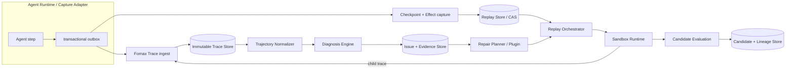

# 轨迹记录、诊断与修复：第一性原理与开源项目对照

> 调研日期：2026-09-02  
> 研究范围：开源 LLM observability、durable execution、agent runtime、evaluation 与自动优化项目。  
> 核心问题：轨迹记录、轨迹诊断、轨迹修复是否应该拆开；Snapshot 应归记录系统还是修复系统。

## 结论先行

从第一性原理看，三分法还少了一层。更稳健的拆法是四个逻辑子系统：

1. **事实层（Trace / Event Store）**：不可变地记录“实际发生了什么”。
2. **执行层（Checkpoint / Effect Store）**：保存“从哪里可以继续执行”以及外部副作用的结果。
3. **诊断层（Evaluation / Diagnosis）**：从事实中产生可版本化的评分、问题与证据。
4. **修复层（Repair / Search / Replay）**：从 checkpoint 分叉，生成候选并重新执行，产生子 Trace。

因此：

- **轨迹记录和修复不应做成同一个服务，也不应共享可变数据模型。**修复不能覆盖原始 Trace，只能创建带 lineage 的分支。
- **Trace 记录与 checkpoint 捕获应由同一 Agent runtime hook 协同触发。**这是为了让 `trace_id / step_id / checkpoint_id / effect_id` 一致，不代表两者要存入同一张表。
- **Snapshot 属于可重放执行底座，不属于 observability 数据库。**诊断通常只需要 Trace；修复若要从中间步骤继续，则需要 checkpoint、版本清单和副作用记录。
- **Snapshot 本身仍不足以复现。**完整的可复现单元应是 `Replay Package = Checkpoint + Event/Effect Log + Artifact refs + Version Manifest + Replay Policy`。

一句话概括推荐边界：

> 记录系统保存证据，执行系统保存可继续状态，诊断系统解释证据，修复系统只创建反事实分支。

## 1. 第一性原理：先定义不可破坏的系统性质

### 1.1 事实不可被反事实污染

原 Trace 回答的是“生产运行发生了什么”；修复后的运行回答的是“如果改变某一步，会发生什么”。二者不能写回同一条历史。

必须满足：

```text
source_trace --diagnosed_by--> diagnosis
source_trace --forked_at(checkpoint)--> candidate_trace
candidate_trace --evaluated_by--> evaluation
```

修复是 DAG 中的新节点，不是原节点的 update。

### 1.2 Trace 不等于可执行状态

Span 通常包含输入、输出、耗时和父子关系；它是 observation。继续执行还需要 runtime state，例如图的 channel values、下一节点、并行分支状态、conversation HEAD、工作区文件状态等。

```text
Trace = 观察到的执行投影
Checkpoint = 运行时可恢复状态
```

[LangGraph 的 persistence 文档](https://docs.langchain.com/oss/python/langgraph/persistence)明确把 checkpointer 定义为 thread-scoped graph state snapshot；[time-travel 文档](https://docs.langchain.com/oss/python/langgraph/use-time-travel)则说明从 checkpoint 之后的节点会重新执行，LLM 和 API 请求也会再次发生。这恰好说明 Span 树和 checkpoint 是两种不同的数据产品。

### 1.3 Checkpoint 不等于外部世界

即使恢复了内存状态，数据库、网页、文件、搜索结果、时间、模型采样结果都可能变化。可复现性真正困难的部分是副作用边界。

[Temporal](https://docs.temporal.io/workflow-definition)要求 workflow 代码可确定性重放，把 API、LLM、数据库等非确定操作放入 replay path 之外的 Activities；执行时产生的 command 会与已有 Event History 对齐。其 [Event History](https://docs.temporal.io/workflow-execution/event)是 append-only log，Reset 会复制历史到某个点再创建新 execution；Side Effect 在 replay 时返回记录值而不重新执行。

因此系统至少要区分：

- 状态变更：可由 checkpoint/event 恢复；
- 纯计算：可以安全重算；
- 非确定读取：默认复用旧结果，反事实实验可选择重查；
- 外部写入：必须 sandbox、mock 或依赖 idempotency key，不能默认重放。

### 1.4 诊断不等于评分，评分不等于修复指令

一个数值 score 适合排序，但无法直接告诉 optimizer 改哪里；自然语言 critique 信息更丰富，但不能直接作为稳定的回归指标。

[DSPy 的 metric 设计](https://github.com/stanfordnlp/dspy/blob/main/docs/docs/diving-deeper/metrics-and-evaluation.md)把二者明确分开：`Evaluate` 只读取 `score`，GEPA 才读取 `feedback`；metric 还可以接收结构化执行 trace。这是很值得复用的协议边界：

```text
Evaluation  = scalar / categorical judgement
Diagnosis   = issue + evidence + causal hypothesis + repair affordance
```

### 1.5 修复本质上是受约束搜索

修复并不是“让另一个 LLM 改一下 prompt”，而是在候选空间中：选择父代、选择变异点、生成变异、执行、评估、保留或淘汰。

[DSPy GEPA](https://github.com/stanfordnlp/dspy/blob/main/docs/docs/diving-deeper/gepa-in-depth.md)保存每个候选及父代、aggregate/per-example score，并从 per-example Pareto frontier 采样父代；[Opik Agent Optimizer](https://www.comet.com/docs/opik/development/optimization-runs/overview)则把 dataset、metric、trace 和 MetaPrompt/HRPO/Evolutionary/GEPA 等 optimizer 统一到 optimization run 中。两者都把修复结果建模为新候选，而不是修改历史 Trace。

### 1.6 在线记录必须便宜，诊断和搜索可以异步

记录是生产请求的热路径；LLM judge、聚类、候选生成和 replay 是计算密集型冷路径。MLflow 的生产 tracing 建议异步上报并对 trace/judge 采样；其[生产 Trace 评估](https://www.mlflow.org/docs/latest/genai/eval-monitor/running-evaluation/traces/)支持保存一次 Trace、离线重复评估，避免每次重新调用模型。

所以录制链路绝不能同步等待诊断或修复。

## 2. 开源项目到底怎么拆

| 项目 | 事实记录 | 可恢复状态 | Replay / Fork | 诊断 | 自动修复 | 实际边界 |
|---|---|---|---|---|---|---|
| Langfuse | Trace/Observation | 无通用 runtime checkpoint | 通过 dataset 重新跑应用 | Score、LLM judge | 非核心能力 | 记录、评分、实验分开 |
| Phoenix | OTel/OpenInference Span | 无通用 runtime checkpoint | 单个 LLM Span Replay；dataset experiment | code/LLM eval | Prompt Playground 人工迭代 | invocation replay，不是 workflow replay |
| MLflow | Trace + assessment | 无通用 runtime checkpoint | 旧 Trace 可重复评分；dataset 跑新版本 | scorer/judge | 非核心能力 | production trace → dataset → experiment |
| Temporal | append-only Event History | workflow state 由历史恢复 | deterministic replay、Reset | 非 LLM 诊断平台 | 非 LLM optimizer | 副作用隔离最严格的 durable runtime |
| LangGraph | 图 state checkpoint | 有 | checkpoint replay、state fork | 需外接 evaluator | 需外接 optimizer | checkpoint 属于执行 runtime |
| Apache Burr | telemetry + action log | immutable State persistence | 可按 sequence 恢复/分叉 | UI/外接 | 无通用 optimizer | state、telemetry 通过 hooks 解耦 |
| OpenHands SDK | conversation EventLog/trajectory | base state + workspace abstraction | event tree branch、resume | stuck/security 等运行时诊断 | Agent 可继续修代码 | 对话事件与工作区状态并存 |
| DSPy GEPA | 优化期间的 program trace | 无生产 runtime snapshot | 在 dataset 上重跑 program | score + textual feedback | candidate mutation/merge | 诊断反馈驱动候选搜索 |
| Opik | Trace、dataset、metrics | 无通用 runtime snapshot | optimization trials 重跑 | metrics、failure analysis | 多种 optimizer | 最接近一体化，但仍以 dataset/run 为边界 |

### 2.1 Observability 项目：记录、标注、实验天然分离

Langfuse 的 ingest schema 中 `trace-create`、`span-create`、`score-create`、`dataset-run-item-create` 是独立事件；[Score 数据模型](https://langfuse.com/docs/evaluation/scores/data-model)允许 score 在 Trace 产生后再附着到 Trace、Observation、Session 或 Dataset Run。其[实验 API](https://langfuse.com/docs/api-and-data-platform/features/experiments-api)把 input、expected output、actual output、scores 与完整 Trace 关联。

Phoenix 也采用相同主路径：trace → eval → 从失败中建 dataset → 修改 prompt/app → experiment。[Span Replay](https://arize.com/docs/phoenix/prompt-engineering/overview-prompts/span-replay)只重放一个已记录的 LLM invocation，可替换 prompt、model 或参数；它并不声称恢复整个 Agent 的外部状态。

MLflow 更明确支持把[历史生产 Trace 筛入 evaluation dataset](https://mlflow.org/docs/latest/genai/datasets/)，同时允许 dataset 有或没有 ground truth。这里的 “repair” 是测试一个新应用版本，而不是在原 Trace 内就地修改。

**可借鉴点**：事实、评分、数据集、实验四种实体必须分开；评价可以被重复执行和版本化。

**不足**：它们解决的是观察和实验管理，不提供通用的中途恢复能力。

### 2.2 Durable runtime：checkpoint 必须在执行器内部

LangGraph 每个 super-step 保存图状态。Replay 复用 checkpoint 之前的状态，但重新执行之后的节点；Fork 通过 `update_state` 创建新 checkpoint 分支，原历史不变。这是最接近我们 “修复某一步再往后跑” 的 API 形态。

Temporal 更接近底层正确性模型：

- 事实是 append-only Event History；
- workflow orchestration 必须 deterministic；
- LLM/API/DB 调用必须成为有记录结果的 Activity；
- reset/fork 产生新 execution；
- 代码版本变化必须有 versioning/patching 协议。

[Apache Burr](https://github.com/apache/burr/blob/main/docs/concepts/overview.rst)把 State 设计为 immutable，把持久化与 telemetry 做成生命周期 hooks；其 tracking client 源码还记录 child 与 fork parent 的 sequence pointer。说明 runtime state 与 trace 可以共用生命周期 hook，但不必使用同一存储模型。

[OpenHands SDK 的 ConversationState](https://github.com/OpenHands/software-agent-sdk/blob/main/openhands-sdk/openhands/sdk/conversation/state.py)同时维护 file-backed EventLog、base state snapshot 和可移动的 conversation HEAD；切换分支时用 active event path 重建 view。OpenHands 还区分 conversation persistence 与 workspace abstraction，进一步说明代码 Agent 的可恢复性不能只靠对话 trajectory。

**可借鉴点**：checkpoint capture 必须贴近 runtime，repair/replay 才能消费它。

**不足**：这类项目通常不负责跨任务的评分、错误聚类或候选优化。

### 2.3 Optimization 项目：修复运行是独立谱系

GEPA 使用带自然语言反馈的 metric，针对低分样本反思并变异一个或多个 program component；候选有父代、验证集总分、逐样本分数和发现成本。Pareto frontier 让 “只擅长某一类样本” 的候选也有机会成为下一轮父代，而不是被单一平均分过早淘汰。

Opik 将同一思路产品化为独立 optimization run：输入是 dataset、metric 和可优化 Agent；输出是 trials/candidates 及 trace-level evidence。其开源 optimizer SDK 支持 Evolutionary、GEPA、HRPO、MetaPrompt、参数优化等统一接口。

TextGrad 则把 prompt/code/文本变量放入文本计算图，通过 LLM loss 产生 textual gradient 再更新变量。它证明“诊断—修复”可以在受控优化任务内紧耦合，但这个前提不适合泛化到生产 observability：只有显式声明为 variable 的内容才允许被更新。

**可借鉴点**：修复系统需要候选谱系、预算、训练/验证隔离和组件级变异。

**不足**：optimizer 通常重新执行完整 program，不替我们解决任意生产 Agent 的 checkpoint 和外部副作用。

## 3. 最关键的纠偏：不要把 Snapshot 当成一个字段

推荐定义三种 replay，而不是一个模糊的“复现”按钮。

| 模式 | 上游步骤 | LLM/tool 结果 | 外部写入 | 用途 |
|---|---|---|---|---|
| Historical replay | 全部读取旧事件 | 读取记录结果 | 永不重做 | 调试 UI、重新评分、重建状态 |
| Counterfactual fork | patch 点之前复用 | 从 patch 点起按 policy 选择复用或重调 | sandbox/mock/idempotent only | 修复候选比较 |
| Live validation | 从任务入口或环境快照重跑 | 全部真实调用 | 只允许隔离环境 | 最终回归与部署前验证 |

对应的数据对象不应叫单一 `snapshot`，而应叫 `ReplayPackage`：

```yaml
replay_package_id: rp_xxx
source_trace_id: tr_xxx
checkpoint:
  runtime: langgraph|eino|openhands|custom
  step_id: step_17
  state_ref: cas://sha256/...
event_log_ref: cas://sha256/...
effects:
  - effect_id: eff_18
    kind: llm|tool|http|db_read|db_write|human
    request_hash: sha256:...
    response_ref: cas://sha256/...
    replay_policy: recorded|reexecute|mock|forbid
    idempotency_key: optional
artifacts:
  - uri: workspace://repo/file.py
    digest: sha256:...
versions:
  agent_code: git:commit
  workflow_schema: v3
  prompt: prompt_id@version
  tool_schema: sha256:...
  model: provider/model/revision
  sandbox_image: image@sha256:...
randomness:
  seed: 42
  sampling_params: {...}
```

其中任何秘密都只保存 secret reference 和权限信封，不把明文 token 写入可下载包。

## 4. 给 Trace Hunter 的推荐架构



### 4.1 事实层：继续复用 Fornax

职责：

- append-only 原始 Span；
- Trace/Span/时间/Tag 查询；
- 完整性指标与采集质量；
- 原始 payload 的冷热分层。

不负责：

- 把某个评价写回为“真相”；
- 保存 runtime 私有 state；
- 执行修复。

### 4.2 Replay substrate：新增，不塞进 Fornax Span 宽表

职责：

- checkpoint manifest；
- effect request/response log；
- workspace/artifact 的 content-addressed reference；
- code/prompt/tool/model/sandbox versions；
- replay policy 与访问控制。

大对象放 CAS/Object Storage；关系元数据放 PostgreSQL。代码 Agent 的 workspace 优先保存 git tree/commit + overlay diff，使用 copy-on-write，而不是每一步复制整个目录。

### 4.3 诊断层：只读事实，输出结构化问题

建议输出：

```yaml
diagnosis_id: dg_xxx
trace_id: tr_xxx
policy_version: policy@12
issue_type: evidence_gap|leakage|tool_misuse|loop|...
severity: 0.0-1.0
confidence: 0.0-1.0
evidence:
  - span_id: sp_17
    claim: "结论早于证据获取"
causal_hypothesis: "planner prematurely terminated"
repair_affordance:
  mutable_components: [planner_prompt, termination_rule]
  earliest_safe_checkpoint: cp_16
score_effects:
  evidence_quality: -0.3
```

诊断版本变化只追加新记录，不改变 Trace。

### 4.4 修复层：插件化搜索，不拥有源数据

每个 repair plugin 接收：

```text
(normalized_trajectory, diagnoses, replay_capabilities, budget)
    -> candidate_patch[]
```

候选 patch 可以修改 prompt、tool schema、routing、termination rule、context selection 或代码，但必须显式声明允许修改的组件。Replay Orchestrator 决定从哪个 checkpoint、用哪种 policy 执行；plugin 无权直接操作生产环境。

候选数据模型至少包含：

```text
candidate_id, parent_candidate_ids, source_trace_id,
base_checkpoint_id, patch_set, replay_policy,
result_trace_id, per_case_scores, aggregate_scores,
diagnosis_delta, cost, status
```

## 5. Snapshot 应在什么时候做

不建议每个 token 或每个普通 Span 都做完整快照。合理策略是“连续事件日志 + 语义边界 checkpoint + 大对象内容寻址”。

优先 checkpoint 的边界：

1. 一个 Agent turn 开始；
2. graph node / planner step 提交后；
3. 外部副作用前后；
4. human approval / interrupt；
5. 并行分支 join；
6. terminal decision 之前；
7. 上一次 checkpoint 之后 state delta 超阈值。

这样可以在存储成本和最小重算距离之间做权衡。checkpoint frequency 是 runtime 策略参数，不应由每个诊断规则单独决定。

## 6. 面对任意第三方 Agent：能力分级，不假装都能重放

| 等级 | 能力 | 所需接入 |
|---|---|---|
| L0 Trace-only | 查看、诊断、离线评分 | OTel/Fornax Span |
| L1 Invocation replay | 重放单个 LLM/tool call | 完整 request、response、schema |
| L2 State replay | 从 Agent step 继续 | runtime checkpoint adapter |
| L3 Environment replay | 恢复 workspace/sandbox | artifact snapshot/COW image |
| L4 Effect-consistent fork | 精确控制旧结果与新副作用 | effect log + replay policy + idempotency |

平台必须在 Trace 上标记 `replay_capability_level`。没有 runtime adapter 的外部 Agent 只能从任务 input 重跑，不能承诺从任意 Span 恢复。

## 7. 分阶段落地

### Phase 0：先保证证据与血缘正确

- 保留 Fornax 原始 Trace；
- 新增 diagnosis、candidate、lineage 三种独立实体；
- 为每次运行记录 agent/prompt/tool/model/code 版本；
- 定义 child trace 与 source trace 的关系。

### Phase 1：调用级 Counterfactual Replay

- 支持从某个 LLM/tool Span 提取完整调用；
- 替换 prompt/model/参数后重放；
- 新调用产生 child Trace；
- 外部写工具默认禁止。

这一阶段接近 Phoenix Span Replay，开发量小，能先验证 UI 和候选比较。

### Phase 2：受控 runtime checkpoint

- 先支持我们自己控制的 Eino/LangGraph runtime；
- 按 semantic step 保存 state delta；
- 对 LLM/tool/db/http 建 effect adapter；
- repair 从 checkpoint 分叉而不是从头跑。

### Phase 3：诊断驱动修复搜索

- `score` 与 `feedback/diagnosis` 分开；
- repair plugin 只修改 allowlist component；
- cheap checks → sampled LLM judge → sandbox replay → holdout validation；
- 保存 per-case Pareto frontier，避免平均分压死专长候选。

### Phase 4：数据闭环与平台更新

- 失败簇自动进入 dataset；
- 通用规则由平台版本化，领域规则由专家包提供；
- 候选只在 holdout 和安全约束通过后才能 promote；
- 生产数据只作为证据和回归样本，不被 optimizer 直接覆写。

## 8. 明确不要做的事情

- 不把 Trace Span 当成可恢复 checkpoint。
- 不把完整 Snapshot JSON 塞进 Fornax/ClickHouse Span 表。
- 不让 repair plugin 修改源 Trace 或源 diagnosis。
- 不默认重新执行写数据库、发消息、下单等外部副作用。
- 不用同一批失败样本同时生成修复并宣布修复成功。
- 不把一个 aggregate score 当成全部搜索信号。
- 不宣称 temperature=0 就能复现模型调用；模型/provider/version 变化仍会破坏一致性。
- 不对所有 Trace 做同等昂贵的环境快照；应按 replay capability、采样与失败触发物化。

## 9. 最终架构判断

原问题的答案不是“分开”或“一起”二选一，而是：

```text
部署与数据所有权：分开
运行时捕获协议：一起
事实血缘：强关联
写入权限：单向
```

即：Agent runtime 一次 step commit 同时发出 Trace event 与 checkpoint/effect manifest；Trace 进入 Fornax，checkpoint/effect 进入 Replay Store。诊断只读 Trace，修复只从 Replay Store 创建 fork。所有 fork 重新进入 Trace 系统，形成可比较但不可篡改的闭环。

这同时吸收了 observability 项目的“事实与评价分离”、durable runtime 的“事件历史与副作用隔离”、以及 GEPA/Opik 的“候选谱系与反馈驱动搜索”，比把三个能力揉进一个 trajectory service 更稳定，也更容易从 L0 逐步升级到真正的可复现修复。

